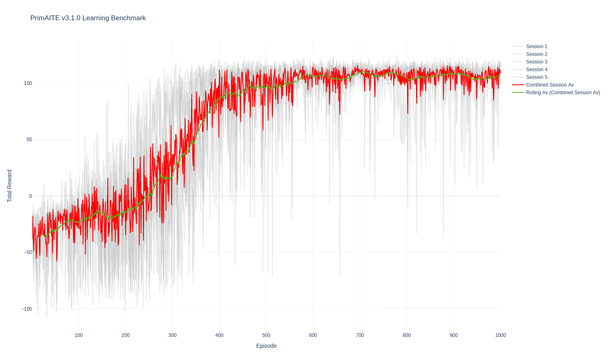
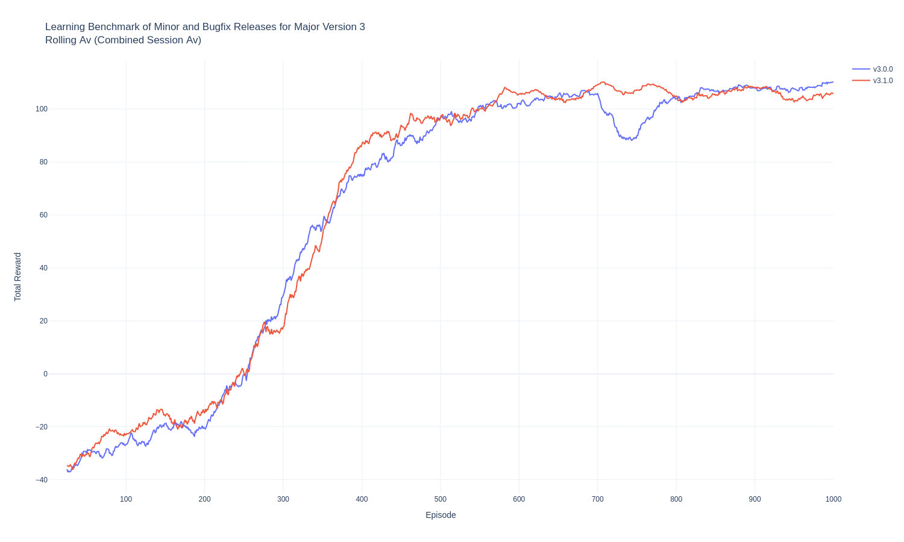
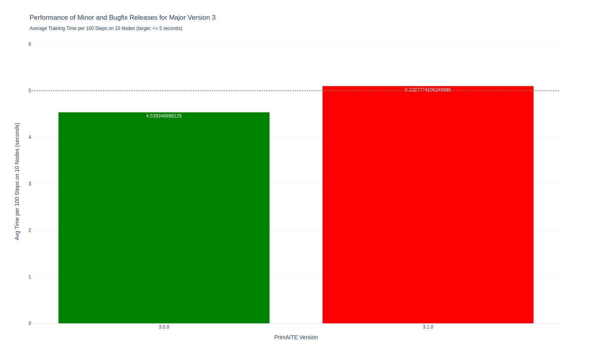

# PrimAITE v3.1.0 Learning Benchmark
## PrimAITE Dev Team
### 2024-07-20

---
## 1 Introduction
PrimAITE v3.1.0 was benchmarked automatically upon release. Learning rate metrics were captured to be referenced during system-level testing and user acceptance testing (UAT).
The benchmarking process consists of running 5 training session using the same config file. Each session trains an agent for 1000 episodes, with each episode consisting of 128 steps.
The total reward per episode from each session is captured. This is then used to calculate an caverage total reward per episode from the 5 individual sessions for smoothing. Finally, a 25-widow rolling average of the average total reward per session is calculated for further smoothing.
## 2 System Information
### 2.1 Python
**Version:** 3.10.14 (main, Apr  6 2024, 18:45:05) [GCC 9.4.0]
### 2.2 System
- **OS:** Linux
- **OS Version:** #76~20.04.1-Ubuntu SMP Thu Jun 13 18:00:23 UTC 2024
- **Machine:** x86_64
- **Processor:** x86_64
### 2.3 CPU
- **Physical Cores:** 2
- **Total Cores:** 4
- **Max Frequency:** 0.00Mhz
### 2.4 Memory
- **Total:** 15.62GB
- **Swap Total:** 0.00B
## 3 Stats
- **Total Sessions:** 5
- **Total Episodes:** 5005
- **Total Steps:** 640000
- **Av Session Duration (s):** 1632.8888
- **Av Step Duration (s):** 0.0510
- **Av Duration per 100 Steps per 10 Nodes (s):** 5.1028
## 4 Graphs
### 4.1 v3.1.0 Learning Benchmark Plot

### 4.2 Learning Benchmark of Minor and Bugfix Releases for Major Version 3

### 4.3 Performance of Minor and Bugfix Releases for Major Version 3

