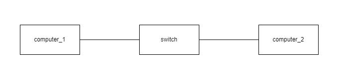

.. only:: comment

    © Crown-owned copyright 2024, Defence Science and Technology Laboratory UK

``simulation``
==============
In this section the network layout is defined. This part of the config follows a hierarchical structure. Almost every component defines a ``ref`` field which acts as a human-readable unique identifier, used by other parts of the config, such as agents.

At the top level of the network are ``nodes``, ``links`` and ``airspace``.

e.g.

.. code-block:: yaml

    simulation:
        network:
            nodes:
            ...
            links:
            ...
            airspace:
            ...

``nodes``
---------

This is where the list of nodes are defined. Some items will differ according to the node type, however, there will be common items such as a node's reference (which is used by the agent), the node's ``type`` and ``hostname``

To see the configuration for these nodes, refer to the following:

.. toctree::
    :maxdepth: 1
    :glob:

    simulation/nodes/computer
    simulation/nodes/firewall
    simulation/nodes/router
    simulation/nodes/server
    simulation/nodes/switch
    simulation/nodes/wireless_router
    simulation/nodes/network_examples

``links``
---------

This is where the links between the nodes are formed.

e.g.

In order to recreate the network below, we will need to create 2 links:

- a link from computer_1 to the switch
- a link from computer_2 to the switch

this results in:

.. code-block:: yaml

    links:
        - endpoint_a_hostname: computer_1
        endpoint_a_port: 1 # port 1 on computer_1
        endpoint_b_hostname: switch
        endpoint_b_port: 1 # port 1 on switch
        bandwidth: 100
        - endpoint_a_hostname: computer_2
        endpoint_a_port: 1 # port 1 on computer_2
        endpoint_b_hostname: switch
        endpoint_b_port: 2 # port 2 on switch
        bandwidth: 100

``ref``
^^^^^^^

The human readable name for the link. Not used in code, however is useful for a human to understand what the link is for.

``endpoint_a_hostname``
^^^^^^^^^^^^^^^^^^^^^^^

The ``hostname`` of the node which must be connected.

``endpoint_a_port``
^^^^^^^^^^^^^^^^^^^

The port on ``endpoint_a_hostname`` which is to be connected to ``endpoint_b_port``.
This accepts an integer value e.g. if port 1 is to be connected, the configuration should be ``endpoint_a_port: 1``

``endpoint_b_hostname``
^^^^^^^^^^^^^^^^^^^^^^^

The ``hostname`` of the node which must be connected.

``endpoint_b_port``
^^^^^^^^^^^^^^^^^^^

The port on ``endpoint_b_hostname`` which is to be connected to ``endpoint_a_port``.
This accepts an integer value e.g. if port 1 is to be connected, the configuration should be ``endpoint_b_port: 1``

``bandwidth``

This is an integer value specifying the allowed bandwidth across the connection. Units are in Mbps.

``airspace``
------------

This section configures settings specific to the wireless network's virtual airspace.

``frequency_max_capacity_mbps``
^^^^^^^^^^^^^^^^^^^^^^^^^^^^^

This setting allows the user to override the default maximum bandwidth capacity set for each frequency. The key should
be the AirSpaceFrequency name and the value be the desired maximum bandwidth capacity in mbps (megabits per second) for
a single timestep.

The below example would permit 123.45 megabits to be transmit across the WiFi 2.4 GHz frequency in a single timestep.
Setting a frequencies max capacity to 0.0 blocks that frequency on the airspace.

.. code-block:: yaml

    simulation:
      network:
        airspace:
          frequency_max_capacity_mbps:
            WIFI_2_4: 123.45
            WIFI_5: 0.0
