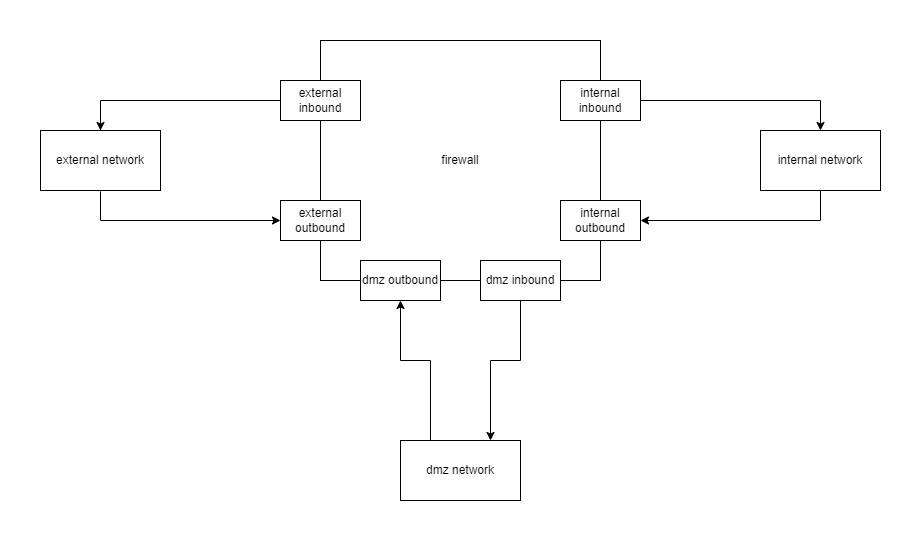

.. only:: comment

    © Crown-owned copyright 2023, Defence Science and Technology Laboratory UK

.. _firewall_configuration:

``firewall``
============

A basic representation of a network router within the simulation.

The firewall is similar to how :ref:`Router <router_configuration>` works, with the difference being how firewall has specific ACL rules for inbound and outbound traffic as well as firewall being limited to 3 ports.

See :py:mod:`primaite.simulator.network.hardware.nodes.network.firewall.Firewall`

example firewall
----------------

.. code-block:: yaml

    simulation:
        network:
            nodes:
                - ref: firewall
                hostname: firewall
                type: firewall
                start_up_duration: 0
                shut_down_duration: 0
                ports:
                    external_port: # port 1
                        ip_address: 192.168.20.1
                        subnet_mask: 255.255.255.0
                    internal_port: # port 2
                        ip_address: 192.168.1.2
                        subnet_mask: 255.255.255.0
                    dmz_port: # port 3
                        ip_address: 192.168.10.1
                        subnet_mask: 255.255.255.0
                acl:
                    internal_inbound_acl:
                        ...
                    internal_outbound_acl:
                        ...
                    dmz_inbound_acl:
                        ...
                    dmz_outbound_acl:
                        ...
                    external_inbound_acl:
                        ...
                    external_outbound_acl:
                        ...
                routes:
                    ...

.. include:: common/common_node_attributes.rst

.. include:: common/node_type_list.rst

``ports``
---------

The firewall node only has 3 ports. These specifically are:

- ``external_port`` (port 1)
- ``internal_port`` (port 2)
- ``dmz_port`` (port 3) (can be optional)

The ports should be defined with an ip address and subnet mask e.g.

.. code-block:: yaml

    nodes:
        - ref: firewall
        ...
        ports:
            external_port: # port 1
                ip_address: 192.168.20.1
                subnet_mask: 255.255.255.0
            internal_port: # port 2
                ip_address: 192.168.1.2
                subnet_mask: 255.255.255.0
            dmz_port: # port 3
                ip_address: 192.168.10.1
                subnet_mask: 255.255.255.0

``ip_address``
""""""""""""""

The IP address for the given port. This must be a valid octet i.e. in the range of ``0.0.0.0`` and ``255.255.255.255``.

``subnet_mask``
"""""""""""""""

Optional. Default value is ``255.255.255.0``.

The subnet mask setting for the port.

``acl``
-------

There are 6 ACLs that can be defined for a firewall

- ``internal_inbound_acl`` for traffic going towards the internal network
- ``internal_outbound_acl`` for traffic coming from the internal network
- ``dmz_inbound_acl`` for traffic going towards the dmz network
- ``dmz_outbound_acl`` for traffic coming from the dmz network
- ``external_inbound_acl`` for traffic coming from the external network
- ``external_outbound_acl`` for traffic going towards the external network

By default, ``external_inbound_acl`` and ``external_outbound_acl`` will permit any traffic through.

``internal_inbound_acl``, ``internal_outbound_acl``, ``dmz_inbound_acl`` and ``dmz_outbound_acl`` will deny any traffic by default, so must be configured to allow defined ``src_port`` and ``dst_port`` or ``protocol``.

See :py:mod:`primaite.simulator.network.hardware.nodes.network.router.AccessControlList`

See :ref:`List of Ports <List of Ports>` for a list of ports.

``internal_inbound_acl``
""""""""""""""""""""""""

ACL rules for packets that have a destination IP address in what is considered the internal network.

example:

.. code-block:: yaml

    nodes:
        - ref: firewall
        ...
        acl:
            internal_inbound_acl:
                22: # position 22 on ACL list
                    action: PERMIT  # allow packets that
                    src_port: ARP   # are emitted from the ARP port
                    dst_port: ARP   # are going towards an ARP port
                23: # position 23 on ACL list
                    action: PERMIT  # allow packets that
                    protocol: ICMP  # are ICMP

``internal_outbound_acl``
"""""""""""""""""""""""""

ACL rules for packets that have a source IP address in what is considered the internal network and is going towards the DMZ network or the external network.

example:

.. code-block:: yaml

    nodes:
        - ref: firewall
        ...
        acl:
            internal_outbound_acl:
                22: # position 22 on ACL list
                    action: PERMIT  # allow packets that
                    src_port: ARP   # are emitted from the ARP port
                    dst_port: ARP   # are going towards an ARP port
                23: # position 23 on ACL list
                    action: PERMIT  # allow packets that
                    protocol: ICMP  # are ICMP

``dmz_inbound_acl``
"""""""""""""""""""

ACL rules for packets that have a destination IP address in what is considered the DMZ network.

example:

.. code-block:: yaml

    nodes:
        - ref: firewall
        ...
        acl:
            dmz_inbound_acl:
                22: # position 22 on ACL list
                    action: PERMIT  # allow packets that
                    src_port: ARP   # are emitted from the ARP port
                    dst_port: ARP   # are going towards an ARP port
                23: # position 23 on ACL list
                    action: PERMIT  # allow packets that
                    protocol: ICMP  # are ICMP

``dmz_outbound_acl``
""""""""""""""""""""

ACL rules for packets that have a source IP address in what is considered the DMZ network and is going towards the internal network or the external network.

example:

.. code-block:: yaml

    nodes:
        - ref: firewall
        ...
        acl:
            dmz_outbound_acl:
                22: # position 22 on ACL list
                    action: PERMIT  # allow packets that
                    src_port: ARP   # are emitted from the ARP port
                    dst_port: ARP   # are going towards an ARP port
                23: # position 23 on ACL list
                    action: PERMIT  # allow packets that
                    protocol: ICMP  # are ICMP

``external_inbound_acl``
""""""""""""""""""""""""

Optional. By default, this will allow any traffic through.

ACL rules for packets that have a destination IP address in what is considered the external network.

example:

.. code-block:: yaml

    nodes:
        - ref: firewall
        ...
        acl:
            external_inbound_acl:
                22: # position 22 on ACL list
                    action: PERMIT  # allow packets that
                    src_port: ARP   # are emitted from the ARP port
                    dst_port: ARP   # are going towards an ARP port
                23: # position 23 on ACL list
                    action: PERMIT  # allow packets that
                    protocol: ICMP  # are ICMP

``external_outbound_acl``
"""""""""""""""""""""""""

Optional. By default, this will allow any traffic through.

ACL rules for packets that have a source IP address in what is considered the external network and is going towards the DMZ network or the internal network.

example:

.. code-block:: yaml

    nodes:
        - ref: firewall
        ...
        acl:
            external_outbound_acl:
                22: # position 22 on ACL list
                    action: PERMIT  # allow packets that
                    src_port: ARP   # are emitted from the ARP port
                    dst_port: ARP   # are going towards an ARP port
                23: # position 23 on ACL list
                    action: PERMIT  # allow packets that
                    protocol: ICMP  # are ICMP

.. include:: common/common_network_node_attributes.rst

.. |NODE| replace:: firewall
.. |NODE_TYPE| replace:: ``firewall``
