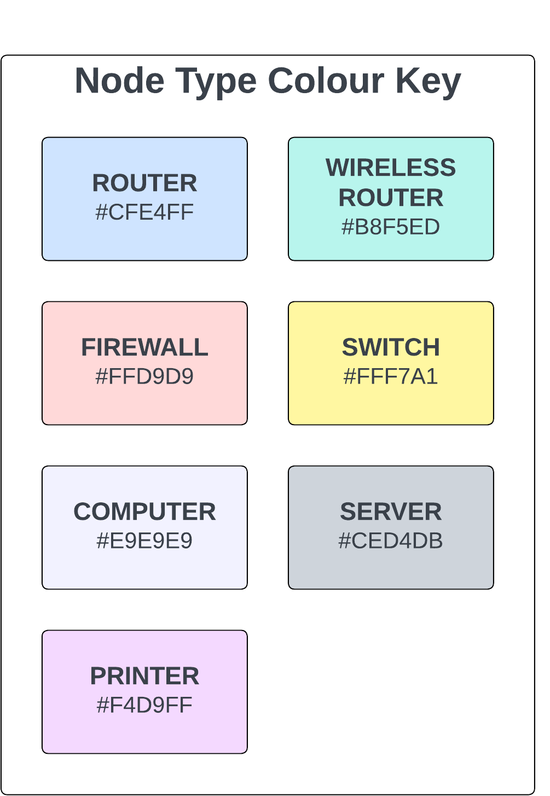
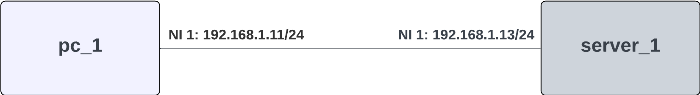

.. only:: comment

    © Crown-owned copyright 2023, Defence Science and Technology Laboratory UK

.. _network_examples:

``Network Examples``
====================

The below examples demonstrate how to configure different types of network in PrimAITE. They examples all have network
topology diagrams. Each rectangle represents a single Node, with the hostname inside of the rectangle. Physical inks are
represented by lines between two nodes. At each end of the line is the network interface number on the node the link is
connected to. Where the network interface is alsoa  layer-3 device, the label also contains the ip address and subnet
mask in CIDR format (``<ip address>/<no mask bits>``). All network diagrams on this page use the following node type
colour key:

#1. Client-Server P2P Network
-----------------------------

This example demonstrates how to create a minimal two-node client-server P2P network. the network consists of a Computer
and a Server on the same subnet with a single Link connecting the two.

#2. Basic Switched Network
--------------------------

In this example we'll create a basic switched network. The network will consist of two Computers, a Server, and a
Switch, all on the same subnet.
