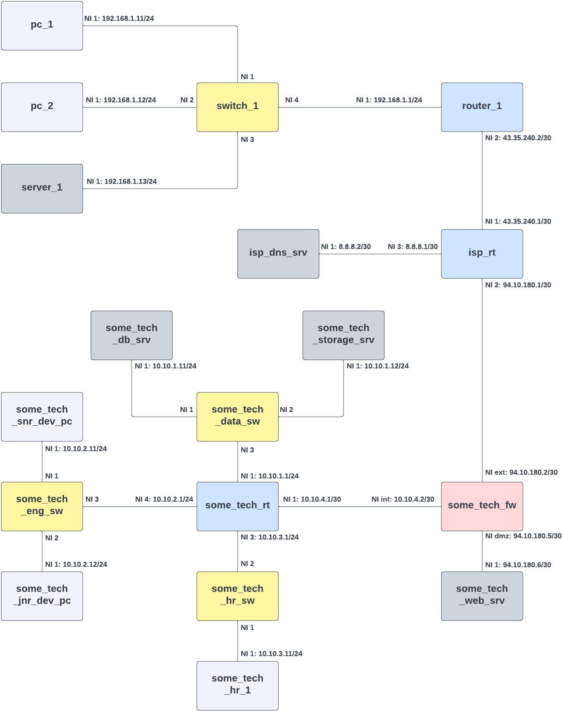

.. only:: comment

    © Crown-owned copyright 2025, Defence Science and Technology Laboratory UK

.. _network_examples:

``Network Examples``
====================

The below examples demonstrate how to configure different types of network in PrimAITE. These examples all have network
topology diagrams. Each rectangle represents a single Node, with the hostname inside of the rectangle. Physical links are
represented by lines between two nodes. At each end of the line is the network interface number on the node the link is
connected to. Where the network interface is also a  layer-3 device, the label also contains the ip address and subnet
mask in CIDR format (``<ip address>/<no mask bits>``). All network diagrams on this page use the following node type
colour key:

.. image:: images/primaite_node_type_colour_key_dark.png
    :width: 300
    :align: center
    :class: only-dark

#1. Client-Server P2P Network
-----------------------------

This example demonstrates how to create a minimal two-node client-server P2P network. The network consists of a Computer
and a Server on the same subnet with a single Link connecting the two.

.. image:: images/primaite_example_client_server_p2p_network_dark.png
    :align: center
    :class: only-dark

.. image:: images/primaite_example_client_server_p2p_network_light.png
    :align: center
    :class: only-light

Node Configuration
^^^^^^^^^^^^^^^^^^

Each node in the network is defined with several attributes, crucial for determining its role and functionality within
the Network:

- **Hostname**: The hostname assigned to the node on the Network.
- **Type**: Specifies the role of the node (e.g., computer, server, etc.).
- **IP Address and Subnet Mask**: These settings define the network interface's IP configuration which is essential for
  network communication.

Link Configuration
^^^^^^^^^^^^^^^^^^

The links section of the YAML configuration file specifies the physical connections between different network nodes
through their respective ports. This section is crucial for setting up the topology of the network, ensuring each node
is properly interconnected to facilitate communication and data transfer within the network. Each link in the network
is described with several attributes that define the connection between two endpoints:

- **endpoint_a_hostname**: The hostname of the first node in the connection.
- **endpoint_a_port**: The port number on the first node where the link is connected.
- **endpoint_b_hostname**: The hostname of the second node in the connection.
- **endpoint_b_port**: The port number on the second node where the link is connected.

Building the Config File
^^^^^^^^^^^^^^^^^^^^^^^^

**Defining the Network Scope and Scale**

1. **Identify the Participants**: The first step is to determine how many nodes are required and their roles. In this case,
   we've chosen a simple two-node P2P architecture with one client (`pc_1`) and one server (`server_1`). This setup is
   chosen to facilitate direct communication between a user (client) and a resource or service (server).
2. **Assign IP Addresses**: Choosing IP addresses that are within the same subnet (`192.168.1.x` with a subnet mask of
   `255.255.255.0`) ensures that the two nodes can communicate without routing.

**Configuring Individual Components**

3. **Node Configuration Simplicity**: With only two participants, the network design is straightforward, focusing on direct
   connectivity. Each node is configured with the minimal required settings: hostname, type, IP address, and subnet mask.
   The simplicity ensures that the configuration is easy to understand and manage.
4. **Logical Assignment of Roles**: The computer is designated as the client and the server as the service provider. This
   reflects typical real-world scenarios where a user's machine connects to a server that hosts resources or services.

**Configuring Connectivity**

5. **Direct Link Setup**: A direct link is planned between the two nodes. This is logical in a minimal setup where the
   primary goal is to ensure efficient, high-speed communication between the client and the server. This direct
   connection is configured through specified ports on each node, ensuring that these are the only two devices on this
   segment of the network.
6. **Port Selection**: Choosing port 1 for both nodes for the connection might be based on convention or simplicity, as
   typically, port numbering starts at 1. This makes it straightforward to follow and document.

.. code-block:: yaml

    simulation:
      network:
        nodes:
          - hostname: pc_1
            type: computer
            ip_address: 192.168.1.11
            subnet_mask: 255.255.255.0

          - hostname: server_1
            type: server
            ip_address: 192.168.1.13
            subnet_mask: 255.255.255.0

        links:
          - endpoint_a_hostname: pc_1
            endpoint_a_port: 1
            endpoint_b_hostname: server_1
            endpoint_b_port: 1

Inspection and Connectivity Test
^^^^^^^^^^^^^^^^^^^^^^^^^^^^^^^^

The following codeblock demonstrates how to access this network and all ``.show()`` to output the network details:

.. code-block:: python

  from primaite.simulator.network.networks import client_server_p2p_network

  network = client_server_p2p_network()

  network.show()

Which gives the output:

.. code-block:: text

  +---------------------------------------+
  |                 Nodes                 |
  +----------+----------+-----------------+
  | Node     | Type     | Operating State |
  +----------+----------+-----------------+
  | server_1 | Server   | ON              |
  | pc_1     | Computer | ON              |
  +----------+----------+-----------------+
  +------------------------------------------------------------------+
  |                           IP Addresses                           |
  +----------+------+--------------+---------------+-----------------+
  | Node     | Port | IP Address   | Subnet Mask   | Default Gateway |
  +----------+------+--------------+---------------+-----------------+
  | server_1 | 1    | 192.168.1.13 | 255.255.255.0 | None            |
  | pc_1     | 1    | 192.168.1.11 | 255.255.255.0 | None            |
  +----------+------+--------------+---------------+-----------------+
  +------------------------------------------------------------------------------------------------------------------------------------------------------+
  |                                                                        Links                                                                         |
  +------------+----------------------------------------+------------+----------------------------------------+-------+-------------------+--------------+
  | Endpoint A | A Port                                 | Endpoint B | B Port                                 | is Up | Bandwidth (MBits) | Current Load |
  +------------+----------------------------------------+------------+----------------------------------------+-------+-------------------+--------------+
  | pc_1       | Port 1: dd:70:be:52:b1:a9/192.168.1.11 | server_1   | Port 1: 17:3a:11:af:9b:b1/192.168.1.13 | True  | 100.0             | 0.00000%     |
  +------------+----------------------------------------+------------+----------------------------------------+-------+-------------------+--------------+

Finally, once the network is configured as expected, a connectivity test should be carried out. This can be done by
"pinging" one node from another node. The below code block demonstrates how `pc_1` pings `server_1`.

.. code-block:: python

    from primaite.simulator.network.networks import client_server_p2p_network_example

    network = client_server_p2p_network_example()

    pc_1 = network.get_node_by_hostname("pc_1")
    pc_1.ping("192.168.1.13)

If SysLog capture is toggled on and the simulation log level is set to INFO, the `pc_1` the result of the ping should be
captured in the `pc_1` SysLog:

.. code-block:: text

    +--------------------------------------------------------------------------------------------------------------------------------------------------------------+
    |                                                                         pc_1 Sys Log                                                                         |
    +-------------------------+-------+----------------------------------------------------------------------------------------------------------------------------+
    | Timestamp               | Level | Message                                                                                                                    |
    +-------------------------+-------+----------------------------------------------------------------------------------------------------------------------------+
    | 2024-04-24 20:50:06,016 | INFO  | Network Interface Port 1: b6:76:56:5b:4a:94/192.168.1.11 enabled                                                           |
    | 2024-04-24 20:50:06,017 | INFO  | Pinging 192.168.1.13:                                                                                                      |
    | 2024-04-24 20:50:06,017 | INFO  | Sending ARP request from NIC Port 1: b6:76:56:5b:4a:94/192.168.1.11 for ip 192.168.1.13                                    |
    | 2024-04-24 20:50:06,018 | INFO  | Adding ARP cache entry for ee:7e:d5:37:41:b8/192.168.1.13 via NIC Port 1: b6:76:56:5b:4a:94/192.168.1.11                   |
    | 2024-04-24 20:50:06,018 | INFO  | Received ARP response for 192.168.1.13 from ee:7e:d5:37:41:b8 via Network Interface Port 1: b6:76:56:5b:4a:94/192.168.1.11 |
    | 2024-04-24 20:50:06,019 | INFO  | Reply from 192.168.1.13: bytes=32, time=<1ms, TTL=63                                                                       |
    | 2024-04-24 20:50:06,020 | INFO  | Reply from 192.168.1.13: bytes=32, time=<1ms, TTL=63                                                                       |
    | 2024-04-24 20:50:06,021 | INFO  | Reply from 192.168.1.13: bytes=32, time=<1ms, TTL=63                                                                       |
    | 2024-04-24 20:50:06,022 | INFO  | Reply from 192.168.1.13: bytes=32, time=<1ms, TTL=63                                                                       |
    | 2024-04-24 20:50:06,022 | INFO  | Ping statistics for 192.168.1.13: Packets: Sent = 4, Received = 4, Lost = 0 (0.0% loss)                                    |
    +-------------------------+-------+----------------------------------------------------------------------------------------------------------------------------+

#2. Basic LAN
-------------

This example demonstrates setting up a basic Local Area Network (LAN) consisting of two Computers, a Server, a Switch,
and a Router, all configured on the same subnet. This type of network is commonly used in small office or home office
settings, providing shared access to resources like files and printers, while also offering a connection to the
internet through a router. This network provides a deeper dive into the new concepts introduced, including default
gateways, router configurations with ACLs, and port settings.

Node Configuration
^^^^^^^^^^^^^^^^^^

- **Type**: We now introduce two new node types, switch and router.

**Computers & Servers**

- **Default Gateway**: The IP address of the router that provides connectivity beyond the local network, essential for
  accessing external networks.

**Routers & Switches**

- **Number of Ports**: Indicates how many physical connections the switch supports, which determines how many devices
  can be connected.

**Routers**

- **Ports Configuration**: Each port on the router can be independently configured with an IP address and subnet mask,
  important for managing different network interfaces.
- **Access Control Lists** (ACLs): Specifies rules that control the flow of traffic into and out of the router,
  enhancing security by permitting or denying traffic based on source/destination IP addresses, and/or source/destination
  ports, and/or protocol.

Building the Config File
^^^^^^^^^^^^^^^^^^^^^^^^

**Defining the Network Scope and Scale**

1. **Identify the Participants**: For the basic LAN, we have identified the need for two computers (pc_1 and pc_2), a
   server (server_1), and networking devices including a switch (switch_1) and a router (router_1). This configuration
   supports a typical small office environment where multiple users require access to shared resources and external
   network connectivity (not configured in this network).

2. **Role Assignment**:

   - **Computers** (`pc_1` and `pc_2`): Act as client systems for users to perform daily tasks and access shared
     resources on the server.
   - **Server** (`server_1`): Hosts resources such as files and applications needed by client systems.
   - **Switch** (`switch_1`): Serves as the central hub connecting all nodes within the LAN to facilitate internal
     network communications.
   - **Router** (`router_1`): Would provide a gateway to external networks, routing traffic between the LAN and the
     internet or other external networks.

**Configuring Connectivity**

3. **Switch Configuration**: The switch is configured with four ports to accommodate the two computers, the server, and
   a connection to the router. This setup ensures all nodes are interconnected for seamless communication within the LAN.
4. **Router Setup as default Gateway**: The router is set up as the default gateway. It has one port that connects to
   the switch.
5. **Security Settings with ACLs**:

   - The ACL on the router (acl: 10) is configured to permit traffic from the specified internal IP range
     (`192.168.0.0/24`) to access the router’s IP address (`192.168.1.1`). Essentially, this ACL allows the nodes in
     the LAN to communicate with their default gateway (but no further at this stage).

6. **Physical Layout Planning**: Each node is strategically connected to the switch to minimise links and optimise
     network performance. The computers (`pc_1` and `pc_2`) and the server (`server_1`) are each connected to individual
     ports on the switch, maintaining an organised and efficient network topology.

.. code-block:: yaml

  simulation:
    network:
      nodes:
        - hostname: pc_1
          type: computer
          ip_address: 192.168.1.11
          subnet_mask: 255.255.255.0
          default_gateway: 192.168.1.1

        - hostname: pc_2
          type: computer
          ip_address: 192.168.1.12
          subnet_mask: 255.255.255.0
          default_gateway: 192.168.1.1

        - hostname: server_1
          type: server
          ip_address: 192.168.1.13
          subnet_mask: 255.255.255.0
          default_gateway: 192.168.1.1

        - hostname: switch_1
          type: switch
          num_ports: 4

        - hostname: router_1
          type: router
          num_ports: 1
          ports:
            1:
              ip_address: 192.168.1.1
              subnet_mask: 255.255.255.0
          acl:
            10:
              action: PERMIT
              src_ip_address: 192.168.0.0
              src_wildcard_mask: 0.0.0.255
              dst_ip_address: 192.168.1.1

      links:
        - endpoint_a_hostname: pc_1
          endpoint_a_port: 1
          endpoint_b_hostname: switch_1
          endpoint_b_port: 1
        - endpoint_a_hostname: pc_2
          endpoint_a_port: 1
          endpoint_b_hostname: switch_1
          endpoint_b_port: 2
        - endpoint_a_hostname: server_1
          endpoint_a_port: 1
          endpoint_b_hostname: switch_1
          endpoint_b_port: 3
        - endpoint_a_hostname: router_1
          endpoint_a_port: 1
          endpoint_b_hostname: switch_1
          endpoint_b_port: 4

Inspection and Connectivity Test
^^^^^^^^^^^^^^^^^^^^^^^^^^^^^^^^

The following codeblock demonstrates how to access this network and all ``.show()`` to output the network details:

.. code-block:: python

    from primaite.simulator.network.networks import basic_lan_network_example

    network = basic_lan_network_example()

    network.show()

Which gives the output:

.. code-block:: text

    +---------------------------------------+
    |                 Nodes                 |
    +----------+----------+-----------------+
    | Node     | Type     | Operating State |
    +----------+----------+-----------------+
    | router_1 | Router   | ON              |
    | switch_1 | Switch   | ON              |
    | server_1 | Server   | ON              |
    | pc_1     | Computer | ON              |
    | pc_2     | Computer | ON              |
    +----------+----------+-----------------+
    +------------------------------------------------------------------+
    |                           IP Addresses                           |
    +----------+------+--------------+---------------+-----------------+
    | Node     | Port | IP Address   | Subnet Mask   | Default Gateway |
    +----------+------+--------------+---------------+-----------------+
    | router_1 | 1    | 192.168.1.1  | 255.255.255.0 | None            |
    | server_1 | 1    | 192.168.1.13 | 255.255.255.0 | 192.168.1.1     |
    | pc_1     | 1    | 192.168.1.11 | 255.255.255.0 | 192.168.1.1     |
    | pc_2     | 1    | 192.168.1.12 | 255.255.255.0 | 192.168.1.1     |
    +----------+------+--------------+---------------+-----------------+
    +-----------------------------------------------------------------------------------------------------------------------------------------+
    |                                                                  Links                                                                  |
    +------------+----------------------------------------+------------+---------------------------+-------+-------------------+--------------+
    | Endpoint A | A Port                                 | Endpoint B | B Port                    | is Up | Bandwidth (MBits) | Current Load |
    +------------+----------------------------------------+------------+---------------------------+-------+-------------------+--------------+
    | router_1   | Port 1: 63:7e:be:05:fa:72/192.168.1.1  | switch_1   | Port 4: 99:e0:be:79:c4:0a | True  | 100.0             | 0.00000%     |
    | server_1   | Port 1: ee:1d:f5:a1:92:85/192.168.1.13 | switch_1   | Port 3: 6c:17:28:4b:98:b9 | True  | 100.0             | 0.00000%     |
    | pc_2       | Port 1: a3:f2:02:bf:f0:7d/192.168.1.12 | switch_1   | Port 2: c5:3e:f2:c0:da:66 | True  | 100.0             | 0.00000%     |
    | pc_1       | Port 1: 27:db:3f:be:ce:9b/192.168.1.11 | switch_1   | Port 1: d1:ff:2f:be:9d:97 | True  | 100.0             | 0.00000%     |
    +------------+----------------------------------------+------------+---------------------------+-------+-------------------+--------------+

Finally, once the network is configured as expected, a connectivity test should be carried out. This can be done by
"pinging" the default gateway of the server and computers (port 1 on `router_1`). Not only will this test the physical
connections, but the ACL that allows the nodes in the LAN to communicate with their default gateway.

.. code-block:: python

    from primaite.simulator.network.networks import basic_lan_network_example

    network = basic_lan_network_example()

    pc_1 = network.get_node_by_hostname("pc_1")
    pc_1.ping(pc_1.default_gateway)

    pc_1.sys_log.show()

If SysLog capture is toggled on and the simulation log level is set to INFO, the `pc_1` the result of the ping should be
captured in the `pc_1` SysLog:

.. code-block:: text

    +-------------------------------------------------------------------------------------------------------------------------------------------------------------+
    |                                                                         pc_1 Sys Log                                                                        |
    +-------------------------+-------+---------------------------------------------------------------------------------------------------------------------------+
    | Timestamp               | Level | Message                                                                                                                   |
    +-------------------------+-------+---------------------------------------------------------------------------------------------------------------------------+
    | 2024-04-24 21:35:09,888 | INFO  | Pinging 192.168.1.1:                                                                                                      |
    | 2024-04-24 21:35:09,889 | INFO  | Sending ARP request from NIC Port 1: 50:fe:d9:ff:a9:4d/192.168.1.11 for ip 192.168.1.1                                    |
    | 2024-04-24 21:35:09,890 | INFO  | Adding ARP cache entry for d2:eb:16:1b:56:0d/192.168.1.1 via NIC Port 1: 50:fe:d9:ff:a9:4d/192.168.1.11                   |
    | 2024-04-24 21:35:09,890 | INFO  | Received ARP response for 192.168.1.1 from d2:eb:16:1b:56:0d via Network Interface Port 1: 50:fe:d9:ff:a9:4d/192.168.1.11 |
    | 2024-04-24 21:35:09,892 | INFO  | Reply from 192.168.1.1: bytes=32, time=1ms, TTL=62                                                                        |
    | 2024-04-24 21:35:09,892 | INFO  | Reply from 192.168.1.1: bytes=32, time=<1ms, TTL=62                                                                       |
    | 2024-04-24 21:35:09,893 | INFO  | Reply from 192.168.1.1: bytes=32, time=<1ms, TTL=62                                                                       |
    | 2024-04-24 21:35:09,894 | INFO  | Reply from 192.168.1.1: bytes=32, time=<1ms, TTL=62                                                                       |
    | 2024-04-24 21:35:09,894 | INFO  | Ping statistics for 192.168.1.1: Packets: Sent = 4, Received = 4, Lost = 0 (0.0% loss)                                    |
    +-------------------------+-------+---------------------------------------------------------------------------------------------------------------------------+

To verify that the ACL on `router_1` worked, we can call `.acl.show()`. This not only shows the ACL rules, but the
number of times each rule has been hit. the code block below is an extension of the above code block that accesses the
`basic_lan_network_example`.

.. code-block:: python

    router_1 = network.get_node_by_hostname("router_1")
    router_1.acl.show()

This gives the output:

.. code-block:: text

    +---------------------------------------------------------------------------------------------------------------------+
    |                                             router_1 Access Control List                                            |
    +-------+--------+----------+-------------+--------------+----------+-------------+--------------+----------+---------+
    | Index | Action | Protocol | Src IP      | Src Wildcard | Src Port | Dst IP      | Dst Wildcard | Dst Port | Matched |
    +-------+--------+----------+-------------+--------------+----------+-------------+--------------+----------+---------+
    | 10    | PERMIT | ANY      | 192.168.1.0 | 0.0.0.255    | ANY      | 192.168.1.1 | 0.0.0.0      | ANY      | 5       |
    | 24    | DENY   | ANY      | ANY         | ANY          | ANY      | ANY         | ANY          | ANY      | 0       |
    +-------+--------+----------+-------------+--------------+----------+-------------+--------------+----------+---------+

#3. Multi-LAN with Internet
---------------------------

This example presents an advanced network configuration that simulates a real-world scenario involving a home or office
network, an Internet Service Provider (ISP), and a comprehensive corporate network for a fictional company named
SomeTech. This extended network includes detailed sub-networks with specialised services, multiple routers featuring
complex routing capabilities, and robust security protocols implemented through Access Control Lists (ACLs). Designed
to mimic the intricacies of actual network environments, this network provides a detailed look at how various network
components interact and function together to support both internal corporate activities and external communications.
NB: the network described here is not the same as the UC7 network used by notebooks such as ``UC7-Training,ipynb`` or
the network in ``Privilege-Escalation-and-Data-Loss-Example.ipynb``.

.. image:: images/primaite_example_multi_lan_with_internet_network_dark.png
    :align: center
    :class: only-dark

Node Configuration
^^^^^^^^^^^^^^^^^^

**Computers and Servers**

- **DNS Server**: Specifies the server that resolves domain names, which is crucial for accessing network services by
  hostname instead of IP addresses. In this scenario, DNS servers play a vital role in connecting with external
  internet services and internal applications.

**Routers & Firewalls**

- **Routes**: Routers also manage specific routes that direct traffic between subnets within the larger network. These routes are defined in the routing table and include:

  - **IP Address**: The IP address of the destination node/subnet.
  - **Subnet Mask**: Defines the size of the destination subnet and differentiates between network address and host identifier.
  - **Next Hop IP Address**: The address of the next hop router or gateway that packets should be sent to when trying
    to reach the destination subnet. This setting is essential for routing decisions in multi-network environments.
- **Default Route**: This is a crucial setting in complex network environments where multiple routers are used. It
  directs outbound traffic to a specified gateway, typically used for accessing the Internet or connecting to upstream
  networks.

**Firewalls**

- **Ports Configuration**: Similar to routers but with named ports to differentiate between external (internet-facing),
  internal, and demilitarized zone (DMZ) connections.
- **ACLs** - The firewall is configured with six primary ACLs, designed to manage the traffic across three key network
  junctions: internal, external, and DMZ.

  - **Internal Port ACLs**:

    - **Inbound ACL**: Controls traffic entering the internal network from other network zones.
    - **Outbound ACL**: Controls traffic leaving the internal network to other parts of the network or the internet.

  - **DMZ Port ACLs**:
    - **Inbound ACL**: Controls traffic coming into the DMZ from the internet or internal network.
    - **Outbound ACL**: Controls traffic leaving the DMZ to reach the internal network or the internet.

  - **External Port ACLs**:

    External ACLs can be used as a single 'catch-all' where two separate but identical rules would be required for both
    internal and DMZ ports.

    - **Inbound ACL**: Controls traffic coming in from the internet, allowing only authorised access to the network.
    - **Outbound ACL**: Regulates what internal traffic can exit to the internet.

Building the Config File
^^^^^^^^^^^^^^^^^^^^^^^^

**Defining the Network Scope and Scale**

1. **Identify the Participants**:

   - **Home/Office Network**: Consists of PCs and servers that handle daily operations and access to shared resources
     like files and applications.
   - **ISP (Internet Service Provider)**: Manages internet connectivity and external routing, acting as the gateway to
     the internet for the SomeTech network. Also enabled DNS lookups.
   - **SomeTech Corporate Network**: A complex internal network with multiple subnets, including a DMZ for public-facing
     services, and segregated internal zones like HR, Engineering, and Data/Storage.

**Node Placement and Configuration**

2. **Strategic Node Placement**

   - **Web Server in the DMZ**: The web server is strategically placed within the Demilitarized Zone (DMZ) to ensure
     that it is accessible from the internet without exposing the internal network to potential security threats. The
     DMZ acts as a segregated area that isolates public-facing services from critical internal resources, reducing the
     risk of external attacks spreading into the corporate network.
   - **Database and Storage Servers**: These servers are located on a separate subnet to enhance security and
     performance. Segmenting these servers allows for more granular control over access and traffic management,
     ensuring that sensitive data is tightly secured and that the traffic does not interfere with other operations
     within the corporate network.

3. **Subnetting Strategy**

   - **/30 Subnets for Router Links**: Links between routers are configured with /30 subnets, which provide just enough
     addresses for two endpoints and a broadcast address, maximizing the efficiency of IP address usage. This subnet
     size is typically used for router-to-router connections to minimise the wastage of IP addresses and to simplify
     network management.

4. **Routing Configurations**

   - **Defining Static Routes**: Static routes are meticulously defined to ensure that data packets find the most
     direct and secure path to their destinations. This involves specifying routes that direct traffic from the
     internal network to the internet, between internal subnets, and to the DMZ.
   - **Use of Default Routes**: Default routes are critical in guiding traffic towards a predefined exit point,
     typically towards the ISP, when no other specific routes match. This setup ensures that external traffic is
     efficiently routed through the network gateway, simplifying the routing table.

5. **Security Measures**

   - **ACLs on Routers and Firewalls**: Access Control Lists (ACLs) are crucial in enforcing security policies.
     They are configured to:

     - **Permit or Deny Specific Traffic**: Depending on the node type and the network segment, ACLs are tailored to
       control what traffic can enter or leave the network. For instance, ACLs on the firewall regulate traffic between
       the internet, DMZ, and internal network.
     - **Support Specific Applications**: ACLs also facilitate the operation of specific applications by allowing
       necessary communications. For example, permitting HTTP traffic to and from the web server in the DMZ ensures
       that web services are accessible without compromising the security of other network segments.
   - **Route Security**: Routing configurations are secured by ensuring that routes do not inadvertently expose
     sensitive parts of the network to unauthorised traffic. Routes are carefully planned to keep internal and external
     traffic separate unless explicitly allowed via ACLs.

SomeTech Corporate Network Explained
^^^^^^^^^^^^^^^^^^^^^^^^^^^^^^^^^^^^

The SomeTech corporate network is designed to support complex and varied operational needs across different departments
and functionalities. It includes a detailed setup with multiple subnets, each tailored to specific functions such as
development, human resources, and data/storage.

**Network Segmentation and Node Deployment**

- **Web Server (some_tech_web_srv)**: Located in the Demilitarized Zone (DMZ) to ensure it is accessible from the
  internet for hosting SomeTech's corporate website or external applications. This placement is crucial for security
  as it isolates the web server from the internal corporate network, protecting sensitive internal data from external
  threats.
- **Firewall (some_tech_fw)**: Acts as a gatekeeper between the external internet, the internal network, and the DMZ.
  It is equipped with multiple ports to distinctly manage traffic:

  - **External Port**: Faces the ISP and handles all inbound and outbound internet traffic.
  - **Internal Port**: Connects to the corporate router, managing traffic to and from the internal subnets.
  - **DMZ Port**: Dedicated to traffic to and from the DMZ, specifically for the web server.

- **Corporate Router (some_tech_rt)**: Central to internal network management, routing traffic across various subnets
  designated for specific departmental functions:

  - **Engineering Subnet**: Hosts developer PCs like some_tech_snr_dev_pc and some_tech_jnr_dev_pc, which are used by
    senior and junior engineers respectively. These workstations are equipped with tools and applications for software
    development and database interaction.
  - **HR Subnet**: Contains the HR PC (some_tech_hr_1), used for managing human resources functions and accessing
    sensitive employee data securely.
  - **Data/Storage Subnet**: Contains the some_tech_db_srv and some_tech_storage_srv servers. Critical for storing and
    managing the company's data. The database server hosts central databases accessed by various applications across
    the network, while the storage server provides data storage solutions and backup services.

**Security and Access Control**

Each node is configured to ensure it meets the specific security and operational requirements of its function:

- **ACLs on Firewall and Routers**: Carefully crafted Access Control Lists ensure that traffic is meticulously screened
  before moving between the DMZ, external internet, and internal subnets. Specific rules include:

  - Permitting database queries from the development PCs to the database server.
  - Permitting database queries from the web server to the database server.
  - Restricting FTP access from junior developer PCs to sensitive areas like the storage server.
  - Allowing necessary web traffic to and from the web server in the DMZ.

.. code-block:: yaml

    simulation:
      network:
        nodes:
          # Home/Office Network
          - hostname: pc_1
            type: computer
            ip_address: 192.168.1.11
            subnet_mask: 255.255.255.0
            default_gateway: 192.168.1.1
            dns_server: 8.8.8.2
            applications:
              - type: database-client
                options:
                  db_server_ip: 10.10.1.11
              - type: web-browser
                options:
                  target_url: http://sometech.ai

          - hostname: pc_2
            type: computer
            ip_address: 192.168.1.12
            subnet_mask: 255.255.255.0
            default_gateway: 192.168.1.1
            dns_server: 8.8.8.2
            applications:
              - type: database-client
                options:
                  db_server_ip: 10.10.1.11
              - type: web-browser
                options:
                  target_url: http://sometech.ai

          - hostname: server_1
            type: server
            ip_address: 192.168.1.13
            subnet_mask: 255.255.255.0
            default_gateway: 192.168.1.1
            dns_server: 8.8.8.2

          - hostname: switch_1
            type: switch
            num_ports: 4

          - hostname: router_1
            type: router
            num_ports: 2
            ports:
              1:
                ip_address: 192.168.1.1
                subnet_mask: 255.255.255.0
              2:
                ip_address: 43.35.240.2
                subnet_mask: 255.255.255.252
            acl:
              10:
                action: PERMIT
            default_route: # Default route to all external networks
              next_hop_ip_address: 43.35.240.1 # NI 1 on icp_router

          # ISP Network
          - hostname: isp_rt
            type: router
            num_ports: 3
            ports:
              1:
                ip_address: 43.35.240.1
                subnet_mask: 255.255.255.252
              2:
                ip_address: 94.10.180.1
                subnet_mask: 255.255.255.252
              3:
                ip_address: 8.8.8.1
                subnet_mask: 255.255.255.252
            acl:
              10:
                action: PERMIT
            routes:
              - address: 192.168.1.0 # Route to the Home/Office LAN
                subnet_mask: 255.255.255.0
                next_hop_ip_address: 43.35.240.2 # NI 2 on router_1
              - address: 10.10.0.0 # Route to the SomeTech internal network
                subnet_mask: 255.255.0.0
                next_hop_ip_address: 94.10.180.2 # NI ext on some_tech_fw
              - address: 94.10.180.6 # Route to the Web Server in the SomeTech DMZ
                subnet_mask: 255.255.255.255
                next_hop_ip_address: 94.10.180.2 # NI ext on some_tech_fw

          - hostname: isp_dns_srv
            type: server
            ip_address: 8.8.8.2
            subnet_mask: 255.255.255.252
            default_gateway: 8.8.8.1
            services:
              - ref: dns_server
                type: dns-server
                options:
                  domain_mapping:
                    sometech.ai: 94.10.180.6

          # SomeTech Network
          - hostname: some_tech_fw
            type: firewall
            ports:
              external_port: # port 1
                ip_address: 94.10.180.2
                subnet_mask: 255.255.255.252
              internal_port: # port 2
                ip_address: 10.10.4.2
                subnet_mask: 255.255.255.252
              dmz_port: # port 3
                ip_address: 94.10.180.5
                subnet_mask: 255.255.255.252
            acl:
              internal_inbound_acl:
                8: # Permit some_tech_web_srv to connect to Database service on some_tech_db_srv
                  action: PERMIT
                  src_ip: 94.10.180.6
                  src_wildcard_mask: 0.0.0.0
                  src_port: POSTGRES_SERVER
                  dst_ip: 10.10.1.11
                  dst_wildcard_mask: 0.0.0.0
                  dst_port: POSTGRES_SERVER
                9: # Permit SomeTech to use HTTP
                  action: PERMIT
                  src_port: HTTP
                10: # Permit SomeTech to use DNS
                  action: PERMIT
                  src_port: DNS
                  dst_port: DNS
              internal_outbound_acl:
                10: # Permit all internal outbound traffic
                  action: PERMIT
              dmz_inbound_acl:
                7: # Permit Database service on some_tech_db_srv to respond to some_tech_web_srv
                  action: PERMIT
                  src_ip: 10.10.1.11
                  src_port: POSTGRES_SERVER
                  src_wildcard_mask: 0.0.0.0
                  dst_ip: 94.10.180.6
                  dst_port: POSTGRES_SERVER
                  dst_wildcard_mask: 0.0.0.0
                8: # Permit SomeTech DMZ to use ARP
                  action: PERMIT
                  src_port: ARP
                  dst_port: ARP
                9: # Permit SomeTech DMZ to use DNS
                  action: PERMIT
                  src_port: DNS
                  dst_port: DNS
                10: # Permit all inbound HTTP requests
                  action: PERMIT
                  dst_port: HTTP
              dmz_outbound_acl:
                7: # Permit some_tech_web_srv to connect to Database service on some_tech_db_srv
                  action: PERMIT
                  src_ip: 94.10.180.6
                  src_port: POSTGRES_SERVER
                  src_wildcard_mask: 0.0.0.0
                  dst_ip: 10.10.1.11
                  dst_port: POSTGRES_SERVER
                  dst_wildcard_mask: 0.0.0.0
                8: # Permit SomeTech DMZ to use ARP
                  action: PERMIT
                  src_port: ARP
                  dst_port: ARP
                9: # Permit SomeTech DMZ to use DNS
                  action: PERMIT
                  src_port: DNS
                  dst_port: DNS
                10: # Permit all outbound HTTP requests
                  action: PERMIT
                  src_port: HTTP
            default_route: # Default route to all external networks
              next_hop_ip_address: 94.10.180.1 # NI 2 on isp_rt
            routes:
              - address: 10.10.0.0 # Route to the SomeTech internal LAN
                subnet_mask: 255.255.0.0
                next_hop_ip_address: 10.10.4.1 # NI 1 on some_tech_rt

          - hostname: some_tech_web_srv
            type: server
            ip_address: 94.10.180.6
            subnet_mask: 255.255.255.252
            default_gateway: 94.10.180.5
            dns_server: 8.8.8.2
            services:
              - ref: web_server
                type: web-server
            applications:
              - type: database-client
                options:
                  db_server_ip: 10.10.1.11

          - hostname: some_tech_rt
            type: router
            num_ports: 4
            ports:
              1:
                ip_address: 10.10.1.1
                subnet_mask: 255.255.255.0
              2:
                ip_address: 10.10.4.1
                subnet_mask: 255.255.255.252
              3:
                ip_address: 10.10.3.1
                subnet_mask: 255.255.255.0
              4:
                ip_address: 10.10.2.1
                subnet_mask: 255.255.255.0

            acl:
              2: # Allow the some_tech_web_srv to connect to the Database Service on some_tech_db_srv
                action: PERMIT
                src_ip: 94.10.180.6
                src_wildcard_mask: 0.0.0.0
                src_port: POSTGRES_SERVER
                dst_ip: 10.10.1.11
                dst_wildcard_mask: 0.0.0.0
                dst_port: POSTGRES_SERVER
              3: # Allow the Database Service on some_tech_db_srv to respond to some_tech_web_srv
                action: PERMIT
                src_ip: 10.10.1.11
                src_wildcard_mask: 0.0.0.0
                src_port: POSTGRES_SERVER
                dst_ip: 94.10.180.6
                dst_wildcard_mask: 0.0.0.0
                dst_port: POSTGRES_SERVER
              4: # Prevent the Junior engineer from downloading files from the some_tech_storage_srv over FTP
                action: DENY
                src_ip: 10.10.2.12
                src_wildcard_mask: 0.0.0.0
                src_port: FTP
                dst_ip: 10.10.1.12
                dst_wildcard_mask: 0.0.0.0
                dst_port: FTP
              5: # Allow communication between Engineering and the DB & Storage subnet
                action: PERMIT
                src_ip: 10.10.2.0
                src_wildcard_mask: 0.0.0.255
                dst_ip: 10.10.1.0
                dst_wildcard_mask: 0.0.0.255
              6: # Allow communication between the DB & Storage subnet and Engineering
                action: PERMIT
                src_ip: 10.10.1.0
                src_wildcard_mask: 0.0.0.255
                dst_ip: 10.10.2.0
                dst_wildcard_mask: 0.0.0.255
              7: # Allow the SomeTech network to use HTTP
                action: PERMIT
                src_port: HTTP
                dst_port: HTTP
              8: # Allow the SomeTech internal network to use ARP
                action: PERMIT
                src_ip: 10.10.0.0
                src_wildcard_mask: 0.0.255.255
                src_port: ARP
              9: # Allow the SomeTech internal network to use ICMP
                action: PERMIT
                src_ip: 10.10.0.0
                src_wildcard_mask: 0.0.255.255
                protocol: ICMP
              10:
                action: PERMIT
                src_ip: 94.10.180.6
                src_wildcard_mask: 0.0.0.0
                src_port: HTTP
                dst_ip: 10.10.0.0
                dst_wildcard_mask: 0.0.255.255
                dst_port: HTTP
              11: # Permit SomeTech to use DNS
                action: PERMIT
                src_port: DNS
                dst_port: DNS
            default_route: # Default route to all external networks
              next_hop_ip_address: 10.10.4.2 # NI int on some_tech_fw

          - hostname: some_tech_data_sw
            type: switch
            num_ports: 3

          - hostname: some_tech_hr_sw
            type: switch
            num_ports: 2

          - hostname: some_tech_eng_sw
            type: switch
            num_ports: 3

          - hostname: some_tech_db_srv
            type: server
            ip_address: 10.10.1.11
            subnet_mask: 255.255.255.0
            default_gateway: 10.10.1.1
            dns_server: 8.8.8.2
            services:
              - type: database-service
                options:
                  backup_server_ip: 10.10.1.12 # The some_tech_storage_srv server
              - type: ftp-client

          - hostname: some_tech_storage_srv
            type: server
            ip_address: 10.10.1.12
            subnet_mask: 255.255.255.0
            default_gateway: 10.10.1.1
            dns_server: 8.8.8.2
            services:
              - type: ftp-server

          - hostname: some_tech_hr_1
            type: computer
            ip_address: 10.10.3.11
            subnet_mask: 255.255.255.0
            default_gateway: 10.10.3.1
            dns_server: 8.8.8.2
            applications:
              - type: database-client
                options:
                  db_server_ip: 10.10.1.11
              - type: web-browser
                options:
                  target_url: http://sometech.ai

          - hostname: some_tech_snr_dev_pc
            type: computer
            ip_address: 10.10.2.11
            subnet_mask: 255.255.255.0
            default_gateway: 10.10.2.1
            dns_server: 8.8.8.2
            applications:
              - type: database-client
                options:
                  db_server_ip: 10.10.1.11
              - type: web-browser
                options:
                  target_url: http://sometech.ai

          - hostname: some_tech_jnr_dev_pc
            type: computer
            ip_address: 10.10.2.12
            subnet_mask: 255.255.255.0
            default_gateway: 10.10.2.1
            dns_server: 8.8.8.2
            applications:
              - type: database-client
                options:
                  db_server_ip: 10.10.1.11
              - type: web-browser
                options:
                  target_url: http://sometech.ai

        links:
          # Home/Office Lan Links
          - endpoint_a_hostname: pc_1
            endpoint_a_port: 1
            endpoint_b_hostname: switch_1
            endpoint_b_port: 1
          - endpoint_a_hostname: pc_2
            endpoint_a_port: 1
            endpoint_b_hostname: switch_1
            endpoint_b_port: 2
          - endpoint_a_hostname: server_1
            endpoint_a_port: 1
            endpoint_b_hostname: switch_1
            endpoint_b_port: 3
          - endpoint_a_hostname: router_1
            endpoint_a_port: 1
            endpoint_b_hostname: switch_1
            endpoint_b_port: 4

          # ISP Links
          - endpoint_a_hostname: isp_rt
            endpoint_a_port: 1
            endpoint_b_hostname: router_1
            endpoint_b_port: 2
          - endpoint_a_hostname: isp_rt
            endpoint_a_port: 2
            endpoint_b_hostname: some_tech_fw
            endpoint_b_port: 1
          - endpoint_a_hostname: isp_rt
            endpoint_a_port: 3
            endpoint_b_hostname: isp_dns_srv
            endpoint_b_port: 1

          # SomeTech LAN Links
          - endpoint_a_hostname: some_tech_fw
            endpoint_a_port: 3
            endpoint_b_hostname: some_tech_web_srv
            endpoint_b_port: 1
          - endpoint_a_hostname: some_tech_fw
            endpoint_a_port: 2
            endpoint_b_hostname: some_tech_rt
            endpoint_b_port: 2
          - endpoint_a_hostname: some_tech_rt
            endpoint_a_port: 1
            endpoint_b_hostname: some_tech_data_sw
            endpoint_b_port: 3
          - endpoint_a_hostname: some_tech_rt
            endpoint_a_port: 3
            endpoint_b_hostname: some_tech_hr_sw
            endpoint_b_port: 2
          - endpoint_a_hostname: some_tech_rt
            endpoint_a_port: 4
            endpoint_b_hostname: some_tech_eng_sw
            endpoint_b_port: 3
          - endpoint_a_hostname: some_tech_data_sw
            endpoint_a_port: 1
            endpoint_b_hostname: some_tech_db_srv
            endpoint_b_port: 1
          - endpoint_a_hostname: some_tech_data_sw
            endpoint_a_port: 2
            endpoint_b_hostname: some_tech_storage_srv
            endpoint_b_port: 1
          - endpoint_a_hostname: some_tech_hr_sw
            endpoint_a_port: 1
            endpoint_b_hostname: some_tech_hr_1
            endpoint_b_port: 1
          - endpoint_a_hostname: some_tech_eng_sw
            endpoint_a_port: 1
            endpoint_b_hostname: some_tech_snr_dev_pc
            endpoint_b_port: 1
          - endpoint_a_hostname: some_tech_eng_sw
            endpoint_a_port: 2
            endpoint_b_hostname: some_tech_jnr_dev_pc
            endpoint_b_port: 1

Inspection and Connectivity Test
^^^^^^^^^^^^^^^^^^^^^^^^^^^^^^^^

The following codeblock demonstrates how to access this network and all ``.show()`` to output the network details:

.. code-block:: python

    from primaite.simulator.network.networks import multi_lan_internet_network_example

    network = multi_lan_internet_network_example()

    network.show()

Which gives the output:

.. code-block:: text

    +----------------------------------------------------+
    |                       Nodes                        |
    +-----------------------+----------+-----------------+
    | Node                  | Type     | Operating State |
    +-----------------------+----------+-----------------+
    | router_1              | Router   | ON              |
    | isp_rt                | Router   | ON              |
    | some_tech_rt          | Router   | ON              |
    | some_tech_fw          | Firewall | ON              |
    | switch_1              | Switch   | ON              |
    | some_tech_data_sw     | Switch   | ON              |
    | some_tech_hr_sw       | Switch   | ON              |
    | some_tech_eng_sw      | Switch   | ON              |
    | server_1              | Server   | ON              |
    | isp_dns_srv           | Server   | ON              |
    | some_tech_web_srv     | Server   | ON              |
    | some_tech_db_srv      | Server   | ON              |
    | some_tech_storage_srv | Server   | ON              |
    | pc_1                  | Computer | ON              |
    | pc_2                  | Computer | ON              |
    | some_tech_hr_1        | Computer | ON              |
    | some_tech_snr_dev_pc  | Computer | ON              |
    | some_tech_jnr_dev_pc  | Computer | ON              |
    +-----------------------+----------+-----------------+
    +-------------------------------------------------------------------------------------+
    |                                     IP Addresses                                    |
    +-----------------------+----------+--------------+-----------------+-----------------+
    | Node                  | Port     | IP Address   | Subnet Mask     | Default Gateway |
    +-----------------------+----------+--------------+-----------------+-----------------+
    | router_1              | 1        | 192.168.1.1  | 255.255.255.0   | None            |
    | router_1              | 2        | 43.35.240.2  | 255.255.255.252 | None            |
    | isp_rt                | 1        | 43.35.240.1  | 255.255.255.252 | None            |
    | isp_rt                | 2        | 94.10.180.1  | 255.255.255.252 | None            |
    | isp_rt                | 3        | 8.8.8.1      | 255.255.255.252 | None            |
    | some_tech_rt          | 1        | 10.10.1.1    | 255.255.255.0   | None            |
    | some_tech_rt          | 2        | 10.10.4.1    | 255.255.255.252 | None            |
    | some_tech_rt          | 3        | 10.10.3.1    | 255.255.255.0   | None            |
    | some_tech_rt          | 4        | 10.10.2.1    | 255.255.255.0   | None            |
    | some_tech_fw          | external | 94.10.180.2  | 255.255.255.252 | None            |
    | some_tech_fw          | internal | 10.10.4.2    | 255.255.255.252 | None            |
    | some_tech_fw          | dmz      | 94.10.180.5  | 255.255.255.252 | None            |
    | server_1              | 1        | 192.168.1.13 | 255.255.255.0   | 192.168.1.1     |
    | isp_dns_srv           | 1        | 8.8.8.2      | 255.255.255.252 | 8.8.8.1         |
    | some_tech_web_srv     | 1        | 94.10.180.6  | 255.255.255.252 | 94.10.180.5     |
    | some_tech_db_srv      | 1        | 10.10.1.11   | 255.255.255.0   | 10.10.1.1       |
    | some_tech_storage_srv | 1        | 10.10.1.12   | 255.255.255.0   | 10.10.1.1       |
    | pc_1                  | 1        | 192.168.1.11 | 255.255.255.0   | 192.168.1.1     |
    | pc_2                  | 1        | 192.168.1.12 | 255.255.255.0   | 192.168.1.1     |
    | some_tech_hr_1        | 1        | 10.10.3.11   | 255.255.255.0   | 10.10.3.1       |
    | some_tech_snr_dev_pc  | 1        | 10.10.2.11   | 255.255.255.0   | 10.10.2.1       |
    | some_tech_jnr_dev_pc  | 1        | 10.10.2.12   | 255.255.255.0   | 10.10.2.1       |
    +-----------------------+----------+--------------+-----------------+-----------------+
    +----------------------------------------------------------------------------------------------------------------------------------------------------------------------------------+
    |                                                                                      Links                                                                                       |
    +-------------------+--------------------------------------------+-----------------------+----------------------------------------------+-------+-------------------+--------------+
    | Endpoint A        | A Port                                     | Endpoint B            | B Port                                       | is Up | Bandwidth (MBits) | Current Load |
    +-------------------+--------------------------------------------+-----------------------+----------------------------------------------+-------+-------------------+--------------+
    | isp_rt            | Port 1: 8c:3c:c0:80:f2:07/43.35.240.1      | router_1              | Port 2: e1:b1:56:2c:fa:df/43.35.240.2        | True  | 100.0             | 0.00000%     |
    | router_1          | Port 1: 54:6c:a6:23:4e:fd/192.168.1.1      | switch_1              | Port 4: fe:fd:f9:00:a7:62                    | True  | 100.0             | 0.00000%     |
    | isp_rt            | Port 3: 2a:af:5c:2b:bc:e1/8.8.8.1          | isp_dns_srv           | Port 1: 23:a3:81:d8:bb:b2/8.8.8.2            | True  | 100.0             | 0.00003%     |
    | isp_rt            | Port 2: 89:9b:bd:03:ab:89/94.10.180.1      | some_tech_fw          | Port external: 9f:4b:76:68:6a:0c/94.10.180.2 | True  | 100.0             | 0.00000%     |
    | some_tech_rt      | Port 4: be:f3:e4:f8:d9:05/10.10.2.1        | some_tech_eng_sw      | Port 3: e2:0c:dc:c5:49:c7                    | True  | 100.0             | 0.00006%     |
    | some_tech_rt      | Port 3: c9:55:0c:c3:f9:af/10.10.3.1        | some_tech_hr_sw       | Port 2: 25:ee:a2:f0:a5:87                    | True  | 100.0             | 0.00003%     |
    | some_tech_rt      | Port 1: 16:0c:1a:ec:91:82/10.10.1.1        | some_tech_data_sw     | Port 3: 70:ea:69:f8:1f:cf                    | True  | 100.0             | 0.00006%     |
    | some_tech_fw      | Port internal: fc:dd:9d:67:23:73/10.10.4.2 | some_tech_rt          | Port 2: f4:af:8e:a4:c7:5a/10.10.4.1          | True  | 100.0             | 0.00000%     |
    | some_tech_fw      | Port dmz: 1b:50:ac:9d:fd:20/94.10.180.5    | some_tech_web_srv     | Port 1: 95:f6:f1:79:57:2d/94.10.180.6        | True  | 100.0             | 0.00003%     |
    | server_1          | Port 1: b8:39:55:01:6b:8b/192.168.1.13     | switch_1              | Port 3: 74:3d:af:db:69:6e                    | True  | 100.0             | 0.00000%     |
    | pc_2              | Port 1: 3b:59:9b:44:22:47/192.168.1.12     | switch_1              | Port 2: 2e:eb:17:f7:a1:92                    | True  | 100.0             | 0.00000%     |
    | pc_1              | Port 1: 82:72:eb:cb:67:50/192.168.1.11     | switch_1              | Port 1: 18:1a:6e:fc:b4:18                    | True  | 100.0             | 0.00000%     |
    | some_tech_data_sw | Port 2: 96:3b:0e:28:95:f2                  | some_tech_storage_srv | Port 1: 05:ee:9e:87:f9:49/10.10.1.12         | True  | 100.0             | 0.00003%     |
    | some_tech_data_sw | Port 1: 0a:69:b6:2e:49:f9                  | some_tech_db_srv      | Port 1: 81:1c:18:96:7f:cf/10.10.1.11         | True  | 100.0             | 0.00003%     |
    | some_tech_hr_sw   | Port 1: 36:4a:02:b7:0c:45                  | some_tech_hr_1        | Port 1: f6:a4:cc:19:15:3b/10.10.3.11         | True  | 100.0             | 0.00003%     |
    | some_tech_eng_sw  | Port 2: f8:54:70:20:97:5d                  | some_tech_jnr_dev_pc  | Port 1: a7:5f:7c:9a:ab:32/10.10.2.12         | True  | 100.0             | 0.00003%     |
    | some_tech_eng_sw  | Port 1: ba:77:f5:9b:89:ae                  | some_tech_snr_dev_pc  | Port 1: ab:3c:5d:27:50:52/10.10.2.11         | True  | 100.0             | 0.00003%     |
    +-------------------+--------------------------------------------+-----------------------+----------------------------------------------+-------+-------------------+--------------+

Once the network in configured, it's vital we check all the services are working as expected, with Router and Firewall
ACLs permitting or denying traffic as per our configured ACL rules.

**Testing Home/Office PCs Can Access the SomeTech website**

.. code-block:: python

    from primaite.simulator.network.networks import multi_lan_internet_network_example
    from src.primaite.simulator.system.applications.web_browser import WebBrowser

    network = multi_lan_internet_network_example()

    pc_1_browser: WebBrowser = network.get_node_by_hostname("pc_1").software_manager.software["WebBrowser"]
    pc_2_browser: WebBrowser = network.get_node_by_hostname("pc_2").software_manager.software["WebBrowser"]

    assert pc_1_browser.get_webpage()
    assert pc_2_browser.get_webpage()

**Testing Home/Office PCs Cannot Access SomeTech DB Servers Database Service**

.. code-block:: python

    from primaite.simulator.network.networks import multi_lan_internet_network_example
    from primaite.simulator.system.applications.database_client import DatabaseClient

    network = multi_lan_internet_network_example()

    pc_1_db_client: DatabaseClient = network.get_node_by_hostname("pc_1").software_manager.software["DatabaseClient"]
    pc_2_db_client: DatabaseClient = network.get_node_by_hostname("pc_2").software_manager.software["DatabaseClient"]

    assert not pc_1_db_client.get_new_connection()
    assert not pc_2_db_client.get_new_connection()

**Testing Home/Office PCs Cannot Access SomeTech Storage Servers FTP Service**

.. code-block:: python

    from primaite.simulator.network.networks import multi_lan_internet_network_example
    from primaite.simulator.system.services.ftp.ftp_client import FTPClient

    network = multi_lan_internet_network_example()

    some_tech_storage_srv = network.get_node_by_hostname("some_tech_storage_srv")
    some_tech_storage_srv.file_system.create_file(file_name="test.png")

    pc_1_ftp_client: FTPClient = network.get_node_by_hostname("pc_1").software_manager.software["ftp-client"]
    pc_2_ftp_client: FTPClient = network.get_node_by_hostname("pc_2").software_manager.software["ftp-client"]

    assert not pc_1_ftp_client.request_file(
        dest_ip_address=some_tech_storage_srv.network_interface[1].ip_address,
        src_folder_name="root",
        src_file_name="test.png",
        dest_folder_name="root",
        dest_file_name="test.png",
    )

    assert not pc_2_ftp_client.request_file(
        dest_ip_address=some_tech_storage_srv.network_interface[1].ip_address,
        src_folder_name="root",
        src_file_name="test.png",
        dest_folder_name="root",
        dest_file_name="test.png",
    )

**Test SomeTech Web Server Can Access SomeTech DB Servers Database Service**

.. code-block:: python

    from primaite.simulator.network.networks import multi_lan_internet_network_example
    from primaite.simulator.system.applications.database_client import DatabaseClient

    network = multi_lan_internet_network_example()

    web_db_client: DatabaseClient = network.get_node_by_hostname("some_tech_web_srv").software_manager.software["DatabaseClient"]

    assert web_db_client.get_new_connection()

**Test SomeTech Web Server Cannot Access SomeTech Storage Servers FTP Service**

.. code-block:: python

    from primaite.simulator.network.networks import multi_lan_internet_network_example
    from primaite.simulator.system.services.ftp.ftp_client import FTPClient
    from primaite.simulator.network.hardware.nodes.host.server import Server

    network = multi_lan_internet_network_example()

    some_tech_storage_srv = network.get_node_by_hostname("some_tech_storage_srv")
    some_tech_storage_srv.file_system.create_file(file_name="test.png")

    web_server: Server = network.get_node_by_hostname("some_tech_web_srv")

    web_ftp_client: FTPClient = web_server.software_manager.software["ftp-client"]

    assert not web_ftp_client.request_file(
        dest_ip_address=some_tech_storage_srv.network_interface[1].ip_address,
        src_folder_name="root",
        src_file_name="test.png",
        dest_folder_name="root",
        dest_file_name="test.png",
    )

**Test SomeTech Dev PCs Can Access SomeTech DB Servers Database Service**

.. code-block:: python

    from primaite.simulator.network.networks import multi_lan_internet_network_example
    from primaite.simulator.system.applications.database_client import DatabaseClient
    from primaite.simulator.network.hardware.nodes.host.computer import Computer

    network = multi_lan_internet_network_example()

    some_tech_snr_dev_pc: Computer = network.get_node_by_hostname("some_tech_snr_dev_pc")
    snr_dev_db_client: DatabaseClient = some_tech_snr_dev_pc.software_manager.software["DatabaseClient"]

    assert snr_dev_db_client.get_new_connection()

    some_tech_jnr_dev_pc: Computer = network.get_node_by_hostname("some_tech_jnr_dev_pc")
    jnr_dev_db_client: DatabaseClient = some_tech_jnr_dev_pc.software_manager.software["DatabaseClient"]

    assert jnr_dev_db_client.get_new_connection()

**Test SomeTech Senior Dev Can Access SomeTech Storage Servers FTP Service**

.. code-block:: python

    from primaite.simulator.network.networks import multi_lan_internet_network_example
    from primaite.simulator.system.services.ftp.ftp_client import FTPClient
    from primaite.simulator.network.hardware.nodes.host.server import Server
    from primaite.simulator.network.hardware.nodes.host.computer import Computer

    network = multi_lan_internet_network_example()

    some_tech_storage_srv: Server = network.get_node_by_hostname("some_tech_storage_srv")
    some_tech_storage_srv.file_system.create_file(file_name="test.png")

    some_tech_snr_dev_pc: Computer = network.get_node_by_hostname("some_tech_snr_dev_pc")
    snr_dev_ftp_client: FTPClient = some_tech_snr_dev_pc.software_manager.software["ftp-client"]

    assert snr_dev_ftp_client.request_file(
        dest_ip_address=some_tech_storage_srv.network_interface[1].ip_address,
        src_folder_name="root",
        src_file_name="test.png",
        dest_folder_name="root",
        dest_file_name="test.png",
    )

**Test SomeTech Junior Dev Cannot Access SomeTech Storage Servers FTP Service**

.. code-block:: python

    from primaite.simulator.network.networks import multi_lan_internet_network_example
    from primaite.simulator.system.services.ftp.ftp_client import FTPClient
    from primaite.simulator.network.hardware.nodes.host.server import Server
    from primaite.simulator.network.hardware.nodes.host.computer import Computer

    network = multi_lan_internet_network_example()

    some_tech_storage_srv: Server = network.get_node_by_hostname("some_tech_storage_srv")
    some_tech_storage_srv.file_system.create_file(file_name="test.png")

    some_tech_jnr_dev_pc: Computer = network.get_node_by_hostname("some_tech_jnr_dev_pc")
    jnr_dev_ftp_client: FTPClient = some_tech_jnr_dev_pc.software_manager.software["ftp-client"]

    assert not jnr_dev_ftp_client.request_file(
        dest_ip_address=some_tech_storage_srv.network_interface[1].ip_address,
        src_folder_name="root",
        src_file_name="test.png",
        dest_folder_name="root",
        dest_file_name="test.png",
    )

**Test SomeTech HR PC Cannot Access SomeTech DB Servers Database Service****

.. code-block:: python

    from primaite.simulator.network.networks import multi_lan_internet_network_example
    from primaite.simulator.system.applications.database_client import DatabaseClient
    from primaite.simulator.network.hardware.nodes.host.computer import Computer

    network = multi_lan_internet_network_example()

    some_tech_hr_pc: Computer = network.get_node_by_hostname("some_tech_hr_1")

    hr_db_client: DatabaseClient = some_tech_hr_pc.software_manager.software["DatabaseClient"]

    assert not hr_db_client.get_new_connection()

**Test SomeTech HR PC Cannot Access SomeTech Storage Servers FTP Service**

.. code-block:: python

    from primaite.simulator.network.networks import multi_lan_internet_network_example
    from primaite.simulator.system.services.ftp.ftp_client import FTPClient
    from primaite.simulator.network.hardware.nodes.host.server import Server
    from primaite.simulator.network.hardware.nodes.host.computer import Computer

    network = multi_lan_internet_network_example()

    some_tech_storage_srv: Server = network.get_node_by_hostname("some_tech_storage_srv")
    some_tech_storage_srv.file_system.create_file(file_name="test.png")

    some_tech_hr_pc: Computer = network.get_node_by_hostname("some_tech_hr_1")
    hr_ftp_client: FTPClient = some_tech_hr_pc.software_manager.software["ftp-client"]

    assert not hr_ftp_client.request_file(
        dest_ip_address=some_tech_storage_srv.network_interface[1].ip_address,
        src_folder_name="root",
        src_file_name="test.png",
        dest_folder_name="root",
        dest_file_name="test.png",
    )
