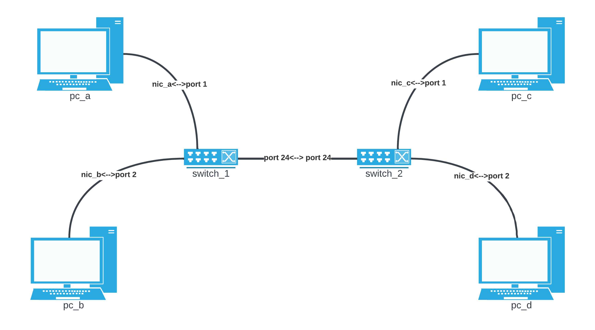

.. only:: comment

    © Crown-owned copyright 2023, Defence Science and Technology Laboratory UK

Base Hardware
=============

The physical layer components are models of a NIC (Network Interface Card), SwitchPort, Node, Switch, and a Link.
These components allow modelling of layer 1 (physical layer) in the OSI model and the nodes that connect to and
transmit across layer 1.

NIC
###
The NIC class provides a realistic model of a Network Interface Card. The NIC acts as the interface between a Node and
a Link, handling IP and MAC addressing, status, and sending/receiving frames.

Addressing
**********

A NIC has both an IPv4 address and MAC address assigned:

- **ip_address** - The IPv4 address assigned to the NIC for communication on an IP network.
- **subnet_mask** - The subnet mask that defines the network subnet.
- **gateway** - The default gateway IP address for routing traffic beyond the local network.
- **mac_address** - A unique MAC address assigned to the NIC by the manufacturer.

Status
******

The status of the NIC is represented by:

- **enabled** - Indicates if the NIC is active/enabled or disabled/down. It must be enabled to send/receive frames.
- **connected_node** - The Node instance the NIC is attached to.
- **connected_link** - The Link instance the NIC is wired to.

Packet Capture
**************

- **pcap** - A PacketCapture instance attached to the NIC for capturing all frames sent and received. This allows packet
capture and analysis.

Sending/Receiving Frames
************************

The NIC can send and receive Frames to/from the connected Link:

- **send_frame()** - Sends a Frame through the NIC onto the attached Link.
- **receive_frame()** - Receives a Frame from the attached Link and processes it.

This allows a NIC to handle sending, receiving, and forwarding of network traffic at layer 2 of the OSI model.
The Frames contain network data encapsulated with various protocol headers.

Basic Usage
***********

.. code-block:: python

    nic1 = NIC(
        ip_address="192.168.0.100",
        subnet_mask="255.255.255.0",
        gateway="192.168.0.1"
    )
    nic1.enable()
    frame = Frame(...)
    nic1.send_frame(frame)

SwitchPort
##########

The SwitchPort models a port on a network switch. It has similar attributes and methods to NIC for addressing, status,
packet capture, sending/receiving frames, etc.

Key attributes:

- **port_num**: The port number on the switch.
- **connected_switch**: The switch to which this port belongs.

Node
####

The Node class represents a base node that communicates on the Network.

Network Interfaces
******************

A Node will typically have one or more NICs attached to it for network connectivity:

- **nics** - A dictionary containing the NIC instances attached to the Node. NICs can be added/removed.

Configuration
*************

- **hostname** - Configured hostname of the Node.
- **operating_state** - Current operating state like ON or OFF. The NICs will be enabled/disabled based on this.

Network Services
****************

A Node runs various network services and components for handling traffic:

- **session_manager** - Handles establishing sessions to/from the Node.
- **software_manager** - Manages software and applications on the Node.
- **arp** - ARP cache for resolving IP addresses to MAC addresses.
- **icmp** - ICMP service for responding to pings and echo requests.
- **sys_log** - System log service for logging internal events and messages.

The SysLog provides a logging mechanism for the Node:

The SysLog records informational, warning, and error events that occur on the Node during simulation. This allows
debugging and tracing program execution and network activity for each simulated Node. Other Node services like ARP and
ICMP, along with custom Applications, services, and Processes will log to the SysLog.

Sending/Receiving
*****************

The Node handles sending and receiving Frames via its attached NICs:

- **send_frame()** - Sends a Frame to the network through one of the Node's NICs.
- **receive_frame()** - Receives a Frame from the network through a NIC. The Node then processes it appropriately based
on the protocols and payload.

Basic Usage
***********

.. code-block:: python

    node1 = Node(hostname='server1')
    node1.operating_state = NodeOperatingState.ON

    nic1 = NIC()
    node1.connect_nic(nic1)

    Send a frame
    frame = Frame(...)
    node1.send_frame(frame)

The Node class brings together the NICs, configuration, and services to model a full network node that can send,
receive, process, and forward traffic on a simulated network.

Switch
######

The Switch subclass models a network switch. It inherits from Node and acts at layer 2 of the OSI model to forward
frames based on MAC addresses.

Inherits Node Capabilities
**************************

Since Switch subclasses Node, it inherits all capabilities from Node like:

- **Managing NICs**
- **Running network services like ARP, ICMP**
- **Sending and receiving frames**
- **Maintaining system logs**

Ports
*****

A Switch has multiple ports implemented using SwitchPort instances:

- **switch_ports** - A dictionary mapping port numbers to SwitchPort instances.
- **num_ports** - The number of ports the Switch has.

Forwarding
**********

A Switch forwards frames between ports based on the destination MAC:

- **dst_mac_table** - MAC address table that maps MACs to SwitchPorts.
- **forward_frame()** - Forwards a frame out the port associated with the destination MAC.

When a frame is received on a SwitchPort:

1. The source MAC address is extracted from the frame.
2. An entry is added to dst_mac_table that maps this source MAC to the SwitchPort it was received on.
3. When a frame with that destination MAC is received in the future, it will be forwarded out this SwitchPort.

This allows the Switch to dynamically build up a mapping table between MAC addresses and SwitchPorts based on traffic
received. If no entry exists for a destination MAC, it floods the frame out all ports.

Link
####

The Link class represents a physical link or connection between two network endpoints like NICs or SwitchPorts.

Endpoints
*********

A Link connects two endpoints:

- **endpoint_a** - The first endpoint, a NIC or SwitchPort.
- **endpoint_b** - The second endpoint, a NIC or SwitchPort.

Transmission
************

Links transmit Frames between the endpoints:

- **transmit_frame()** - Sends a Frame from one endpoint to the other.

Uses bandwidth/load properties to determine if transmission is possible.

Bandwidth & Load
****************

- **bandwidth** - The total capacity of the Link in Mbps.
- **current_load** - The current bandwidth utilization of the Link in Mbps.

As Frames are sent over the Link, the load increases. The Link tracks if there is enough unused capacity to transmit a
Frame based on its size and the current load.

Status
******

- **up** - Boolean indicating if the Link is currently up/active based on the endpoint status.
- **endpoint_up()/down()** - Notifies the Link when an endpoint goes up or down.

This allows the Link to realistically model the connection and transmission characteristics between two endpoints.

Putting it all Together
#######################

We'll now demonstrate how the nodes, NICs, switches, and links connect in a network, including full code examples and
syslog extracts to illustrate the step-by-step process.

To demonstrate successful network communication between nodes and switches, we'll model a standard network with four
PC's and two switches.

Create Nodes & NICs
*******************

First, we'll create the four nodes, each with a single NIC.

.. code-block:: python

    pc_a = Node(hostname="pc_a")
    nic_a = NIC(ip_address="192.168.0.10", subnet_mask="255.255.255.0", gateway="192.168.0.1")
    pc_a.connect_nic(nic_a)
    pc_a.power_on()

    pc_b = Node(hostname="pc_b")
    nic_b = NIC(ip_address="192.168.0.11", subnet_mask="255.255.255.0", gateway="192.168.0.1")
    pc_b.connect_nic(nic_b)
    pc_b.power_on()

    pc_c = Node(hostname="pc_c")
    nic_c = NIC(ip_address="192.168.0.12", subnet_mask="255.255.255.0", gateway="192.168.0.1")
    pc_c.connect_nic(nic_c)
    pc_c.power_on()

    pc_d = Node(hostname="pc_d")
    nic_d = NIC(ip_address="192.168.0.13", subnet_mask="255.255.255.0", gateway="192.168.0.1")
    pc_d.connect_nic(nic_d)
    pc_d.power_on()

This produces:

**node_a NIC table**

+-------------------+--------------+---------------+-----------------+--------------+----------+
| MAC Address       | IP Address   | Subnet Mask   | Default Gateway | Speed (Mbps) | Status   |
+===================+==============+===============+=================+==============+==========+
| 80:af:f2:f6:58:b7 | 102.169.0.10 | 255.255.255.0 | 192.168.0.1     | 100          | Disabled |
+-------------------+--------------+---------------+-----------------+--------------+----------+

**node_a sys log**

.. code-block::

    2023-08-08 15:50:08,355 INFO: Connected NIC 80:af:f2:f6:58:b7/192.168.0.10
    2023-08-08 15:50:08,355 INFO: Turned on

**node_b NIC table**

+-------------------+--------------+---------------+-----------------+--------------+----------+
| MAC Address       | IP Address   | Subnet Mask   | Default Gateway | Speed (Mbps) | Status   |
+===================+==============+===============+=================+==============+==========+
| 98:ad:eb:7c:dc:cb | 102.169.0.11 | 255.255.255.0 | 192.168.0.1     | 100          | Disabled |
+-------------------+--------------+---------------+-----------------+--------------+----------+

**node_b sys log**

.. code-block::

    2023-08-08 15:50:08,357 INFO: Connected NIC 98:ad:eb:7c:dc:cb/192.168.0.11
    2023-08-08 15:50:08,357 INFO: Turned on

**node_c NIC table**

+-------------------+--------------+---------------+-----------------+--------------+----------+
| MAC Address       | IP Address   | Subnet Mask   | Default Gateway | Speed (Mbps) | Status   |
+===================+==============+===============+=================+==============+==========+
| bc:72:82:5d:82:a4 | 102.169.0.12 | 255.255.255.0 | 192.168.0.1     | 100          | Disabled |
+-------------------+--------------+---------------+-----------------+--------------+----------+

**node_c sys log**

.. code-block::

    2023-08-08 15:50:08,358 INFO: Connected NIC bc:72:82:5d:82:a4/192.168.0.12
    2023-08-08 15:50:08,358 INFO: Turned on

**node_d NIC table**

+-------------------+--------------+---------------+-----------------+--------------+----------+
| MAC Address       | IP Address   | Subnet Mask   | Default Gateway | Speed (Mbps) | Status   |
+===================+==============+===============+=================+==============+==========+
| 84:20:7c:ec:a5:c6 | 102.169.0.13 | 255.255.255.0 | 192.168.0.1     | 100          | Disabled |
+-------------------+--------------+---------------+-----------------+--------------+----------+

**node_d sys log**

.. code-block::

    2023-08-08 15:50:08,359 INFO: Connected NIC 84:20:7c:ec:a5:c6/192.168.0.13
    2023-08-08 15:50:08,360 INFO: Turned on

Create Switches
***************

Next, we'll create two six-port switches:

.. code-block:: python

    switch_1 = Switch(hostname="switch_1", num_ports=6)
    switch_1.power_on()

    switch_2 = Switch(hostname="switch_2", num_ports=6)
    switch_2.power_on()

This produces:

**switch_1 MAC table**

+------+-------------------+--------------+----------+
| Port | MAC Address       | Speed (Mbps) | Status   |
+======+===================+==============+==========+
| 1    | 9d:ac:59:a0:05:13 | 100          | Disabled |
+------+-------------------+--------------+----------+
| 2    | 45:f5:8e:b6:f5:d3 | 100          | Disabled |
+------+-------------------+--------------+----------+
| 3    | ef:f5:b9:28:cb:ae | 100          | Disabled |
+------+-------------------+--------------+----------+
| 4    | 88:76:0a:72:fc:14 | 100          | Disabled |
+------+-------------------+--------------+----------+
| 5    | 79:de:da:bd:e2:ba | 100          | Disabled |
+------+-------------------+--------------+----------+
| 6    | 91:d5:83:a0:02:f2 | 100          | Disabled |
+------+-------------------+--------------+----------+

**switch_1 sys log**

.. code-block::

    2023-08-08 15:50:08,373 INFO: Turned on

**switch_2 MAC table**

+------+-------------------+--------------+----------+
| Port | MAC Address       | Speed (Mbps) | Status   |
+======+===================+==============+==========+
| 1    | aa:58:fa:66:d7:be | 100          | Disabled |
+------+-------------------+--------------+----------+
| 2    | 72:d2:1e:88:e9:45 | 100          | Disabled |
+------+-------------------+--------------+----------+
| 3    | 8a:fc:2a:56:d5:c5 | 100          | Disabled |
+------+-------------------+--------------+----------+
| 4    | fb:b5:9a:04:4a:49 | 100          | Disabled |
+------+-------------------+--------------+----------+
| 5    | 88:aa:48:d0:21:9e | 100          | Disabled |
+------+-------------------+--------------+----------+
| 6    | 96:77:39:d1:de:44 | 100          | Disabled |
+------+-------------------+--------------+----------+

**switch_2 sys log**

.. code-block::

    2023-08-08 15:50:08,374 INFO: Turned on

Create Links
************

Finally, we'll create the five links that connect the nodes and the switches:

.. code-block:: python

    link_nic_a_switch_1 = Link(endpoint_a=nic_a, endpoint_b=switch_1.switch_ports[1])
    link_nic_b_switch_1 = Link(endpoint_a=nic_b, endpoint_b=switch_1.switch_ports[2])
    link_nic_c_switch_2 = Link(endpoint_a=nic_c, endpoint_b=switch_2.switch_ports[1])
    link_nic_d_switch_2 = Link(endpoint_a=nic_d, endpoint_b=switch_2.switch_ports[2])
    link_switch_1_switch_2 = Link(
        endpoint_a=switch_1.switch_ports[6], endpoint_b=switch_2.switch_ports[6]
    )

This produces:

**node_a NIC table**

+-------------------+--------------+---------------+-----------------+--------------+---------+
| MAC Address       | IP Address   | Subnet Mask   | Default Gateway | Speed (Mbps) | Status  |
+===================+==============+===============+=================+==============+=========+
| 80:af:f2:f6:58:b7 | 102.169.0.10 | 255.255.255.0 | 192.168.0.1     | 100          | Enabled |
+-------------------+--------------+---------------+-----------------+--------------+---------+

**node_a sys log**

.. code-block::

    2023-08-08 15:50:08,355 INFO: Connected NIC 80:af:f2:f6:58:b7/192.168.0.10
    2023-08-08 15:50:08,355 INFO: Turned on
    2023-08-08 15:50:08,355 INFO: NIC 80:af:f2:f6:58:b7/192.168.0.10 enabled

**node_b NIC table**

+-------------------+--------------+---------------+-----------------+--------------+---------+
| MAC Address       | IP Address   | Subnet Mask   | Default Gateway | Speed (Mbps) | Status  |
+===================+==============+===============+=================+==============+=========+
| 98:ad:eb:7c:dc:cb | 102.169.0.11 | 255.255.255.0 | 192.168.0.1     | 100          | Enabled |
+-------------------+--------------+---------------+-----------------+--------------+---------+

**node_b sys log**

.. code-block::

    2023-08-08 15:50:08,357 INFO: Connected NIC 98:ad:eb:7c:dc:cb/192.168.0.11
    2023-08-08 15:50:08,357 INFO: Turned on
    2023-08-08 15:50:08,357 INFO: NIC 98:ad:eb:7c:dc:cb/192.168.0.11 enabled

**node_c NIC table**

+-------------------+--------------+---------------+-----------------+--------------+---------+
| MAC Address       | IP Address   | Subnet Mask   | Default Gateway | Speed (Mbps) | Status  |
+===================+==============+===============+=================+==============+=========+
| bc:72:82:5d:82:a4 | 102.169.0.12 | 255.255.255.0 | 192.168.0.1     | 100          | Enabled |
+-------------------+--------------+---------------+-----------------+--------------+---------+

**node_c sys log**

.. code-block::

    2023-08-08 15:50:08,358 INFO: Connected NIC bc:72:82:5d:82:a4/192.168.0.12
    2023-08-08 15:50:08,358 INFO: Turned on
    2023-08-08 15:50:08,358 INFO: NIC bc:72:82:5d:82:a4/192.168.0.12 enabled

**node_d NIC table**

+-------------------+--------------+---------------+-----------------+--------------+---------+
| MAC Address       | IP Address   | Subnet Mask   | Default Gateway | Speed (Mbps) | Status  |
+===================+==============+===============+=================+==============+=========+
| 84:20:7c:ec:a5:c6 | 102.169.0.13 | 255.255.255.0 | 192.168.0.1     | 100          | Enabled |
+-------------------+--------------+---------------+-----------------+--------------+---------+

**node_d sys log**

.. code-block::

    2023-08-08 15:50:08,359 INFO: Connected NIC 84:20:7c:ec:a5:c6/192.168.0.13
    2023-08-08 15:50:08,360 INFO: Turned on
    2023-08-08 15:50:08,360 INFO: NIC 84:20:7c:ec:a5:c6/192.168.0.13 enabled

**switch_1 MAC table**

+------+-------------------+--------------+----------+
| Port | MAC Address       | Speed (Mbps) | Status   |
+======+===================+==============+==========+
| 1    | 9d:ac:59:a0:05:13 | 100          | Enabled  |
+------+-------------------+--------------+----------+
| 2    | 45:f5:8e:b6:f5:d3 | 100          | Enabled  |
+------+-------------------+--------------+----------+
| 3    | ef:f5:b9:28:cb:ae | 100          | Disabled |
+------+-------------------+--------------+----------+
| 4    | 88:76:0a:72:fc:14 | 100          | Disabled |
+------+-------------------+--------------+----------+
| 5    | 79:de:da:bd:e2:ba | 100          | Disabled |
+------+-------------------+--------------+----------+
| 6    | 91:d5:83:a0:02:f2 | 100          | Enabled  |
+------+-------------------+--------------+----------+

**switch_1 sys log**

.. code-block::

    2023-08-08 15:50:08,373 INFO: Turned on
    2023-08-08 15:50:08,378 INFO: SwitchPort 9d:ac:59:a0:05:13 enabled
    2023-08-08 15:50:08,380 INFO: SwitchPort 45:f5:8e:b6:f5:d3 enabled
    2023-08-08 15:50:08,384 INFO: SwitchPort 91:d5:83:a0:02:f2 enabled

**switch_2 MAC table**

+------+-------------------+--------------+----------+
| Port | MAC Address       | Speed (Mbps) | Status   |
+======+===================+==============+==========+
| 1    | aa:58:fa:66:d7:be | 100          | Enabled  |
+------+-------------------+--------------+----------+
| 2    | 72:d2:1e:88:e9:45 | 100          | Enabled  |
+------+-------------------+--------------+----------+
| 3    | 8a:fc:2a:56:d5:c5 | 100          | Disabled |
+------+-------------------+--------------+----------+
| 4    | fb:b5:9a:04:4a:49 | 100          | Disabled |
+------+-------------------+--------------+----------+
| 5    | 88:aa:48:d0:21:9e | 100          | Disabled |
+------+-------------------+--------------+----------+
| 6    | 96:77:39:d1:de:44 | 100          | Enabled  |
+------+-------------------+--------------+----------+

**switch_2 sys log**

.. code-block::

    2023-08-08 15:50:08,374 INFO: Turned on
    2023-08-08 15:50:08,381 INFO: SwitchPort aa:58:fa:66:d7:be enabled
    2023-08-08 15:50:08,383 INFO: SwitchPort 72:d2:1e:88:e9:45 enabled
    2023-08-08 15:50:08,384 INFO: SwitchPort 96:77:39:d1:de:44 enabled

Perform Ping
************

Now with the network setup and operational, we can perform a ping to confirm that communication between nodes over a
switched network is possible. In the below example, we ping 192.168.0.13 (node_d) from node_a:

.. code-block:: python

    pc_a.ping("192.168.0.13")

This produces:

**node_a sys log**

.. code-block::

    2023-08-08 15:50:08,355 INFO: Connected NIC 80:af:f2:f6:58:b7/192.168.0.10
    2023-08-08 15:50:08,355 INFO: Turned on
    2023-08-08 15:50:08,355 INFO: NIC 80:af:f2:f6:58:b7/192.168.0.10 enabled
    2023-08-08 15:50:08,406 INFO: Attempting to ping 192.168.0.13
    2023-08-08 15:50:08,406 INFO: No entry in ARP cache for 192.168.0.13
    2023-08-08 15:50:08,406 INFO: Sending ARP request from NIC 80:af:f2:f6:58:b7/192.168.0.10 for ip 192.168.0.13
    2023-08-08 15:50:08,413 INFO: Received ARP response for 192.168.0.13 from 84:20:7c:ec:a5:c6 via NIC 80:af:f2:f6:58:b7/192.168.0.10
    2023-08-08 15:50:08,413 INFO: Adding ARP cache entry for 84:20:7c:ec:a5:c6/192.168.0.13 via NIC 80:af:f2:f6:58:b7/192.168.0.10
    2023-08-08 15:50:08,415 INFO: Sending echo request to 192.168.0.13
    2023-08-08 15:50:08,417 INFO: Received echo reply from 192.168.0.13
    2023-08-08 15:50:08,419 INFO: Sending echo request to 192.168.0.13
    2023-08-08 15:50:08,421 INFO: Received echo reply from 192.168.0.13
    2023-08-08 15:50:08,422 INFO: Sending echo request to 192.168.0.13
    2023-08-08 15:50:08,424 INFO: Received echo reply from 192.168.0.13
    2023-08-08 15:50:08,425 INFO: Sending echo request to 192.168.0.13
    2023-08-08 15:50:08,427 INFO: Received echo reply from 192.168.0.13

**node_b sys log**

.. code-block::

    2023-08-08 15:50:08,357 INFO: Connected NIC 98:ad:eb:7c:dc:cb/192.168.0.11
    2023-08-08 15:50:08,357 INFO: Turned on
    2023-08-08 15:50:08,357 INFO: NIC 98:ad:eb:7c:dc:cb/192.168.0.11 enabled
    2023-08-08 15:50:08,410 INFO: Received ARP request for 192.168.0.13 from 80:af:f2:f6:58:b7/192.168.0.10
    2023-08-08 15:50:08,410 INFO: Ignoring ARP request for 192.168.0.13

**node_c sys log**

.. code-block::

    2023-08-08 15:50:08,358 INFO: Connected NIC bc:72:82:5d:82:a4/192.168.0.12
    2023-08-08 15:50:08,358 INFO: Turned on
    2023-08-08 15:50:08,358 INFO: NIC bc:72:82:5d:82:a4/192.168.0.12 enabled
    2023-08-08 15:50:08,411 INFO: Received ARP request for 192.168.0.13 from 80:af:f2:f6:58:b7/192.168.0.10
    2023-08-08 15:50:08,411 INFO: Ignoring ARP request for 192.168.0.13

**node_d sys log**

.. code-block::

    2023-08-08 15:50:08,359 INFO: Connected NIC 84:20:7c:ec:a5:c6/192.168.0.13
    2023-08-08 15:50:08,360 INFO: Turned on
    2023-08-08 15:50:08,360 INFO: NIC 84:20:7c:ec:a5:c6/192.168.0.13 enabled
    2023-08-08 15:50:08,412 INFO: Received ARP request for 192.168.0.13 from 80:af:f2:f6:58:b7/192.168.0.10
    2023-08-08 15:50:08,412 INFO: Adding ARP cache entry for 80:af:f2:f6:58:b7/192.168.0.10 via NIC 84:20:7c:ec:a5:c6/192.168.0.13
    2023-08-08 15:50:08,412 INFO: Sending ARP reply from 84:20:7c:ec:a5:c6/192.168.0.13 to 192.168.0.10/80:af:f2:f6:58:b7
    2023-08-08 15:50:08,416 INFO: Received echo request from 192.168.0.10
    2023-08-08 15:50:08,417 INFO: Sending echo reply to 192.168.0.10
    2023-08-08 15:50:08,420 INFO: Received echo request from 192.168.0.10
    2023-08-08 15:50:08,420 INFO: Sending echo reply to 192.168.0.10
    2023-08-08 15:50:08,423 INFO: Received echo request from 192.168.0.10
    2023-08-08 15:50:08,423 INFO: Sending echo reply to 192.168.0.10
    2023-08-08 15:50:08,426 INFO: Received echo request from 192.168.0.10
    2023-08-08 15:50:08,426 INFO: Sending echo reply to 192.168.0.10

**switch_1 sys log**

.. code-block::

    2023-08-08 15:50:08,373 INFO: Turned on
    2023-08-08 15:50:08,378 INFO: SwitchPort 9d:ac:59:a0:05:13 enabled
    2023-08-08 15:50:08,380 INFO: SwitchPort 45:f5:8e:b6:f5:d3 enabled
    2023-08-08 15:50:08,384 INFO: SwitchPort 91:d5:83:a0:02:f2 enabled
    2023-08-08 15:50:08,409 INFO: Added MAC table entry: Port 1 -> 80:af:f2:f6:58:b7
    2023-08-08 15:50:08,413 INFO: Added MAC table entry: Port 6 -> 84:20:7c:ec:a5:c6

**switch_2 sys log**

.. code-block::

    2023-08-08 15:50:08,374 INFO: Turned on
    2023-08-08 15:50:08,381 INFO: SwitchPort aa:58:fa:66:d7:be enabled
    2023-08-08 15:50:08,383 INFO: SwitchPort 72:d2:1e:88:e9:45 enabled
    2023-08-08 15:50:08,384 INFO: SwitchPort 96:77:39:d1:de:44 enabled
    2023-08-08 15:50:08,411 INFO: Added MAC table entry: Port 6 -> 80:af:f2:f6:58:b7
    2023-08-08 15:50:08,412 INFO: Added MAC table entry: Port 2 -> 84:20:7c:ec:a5:c6
