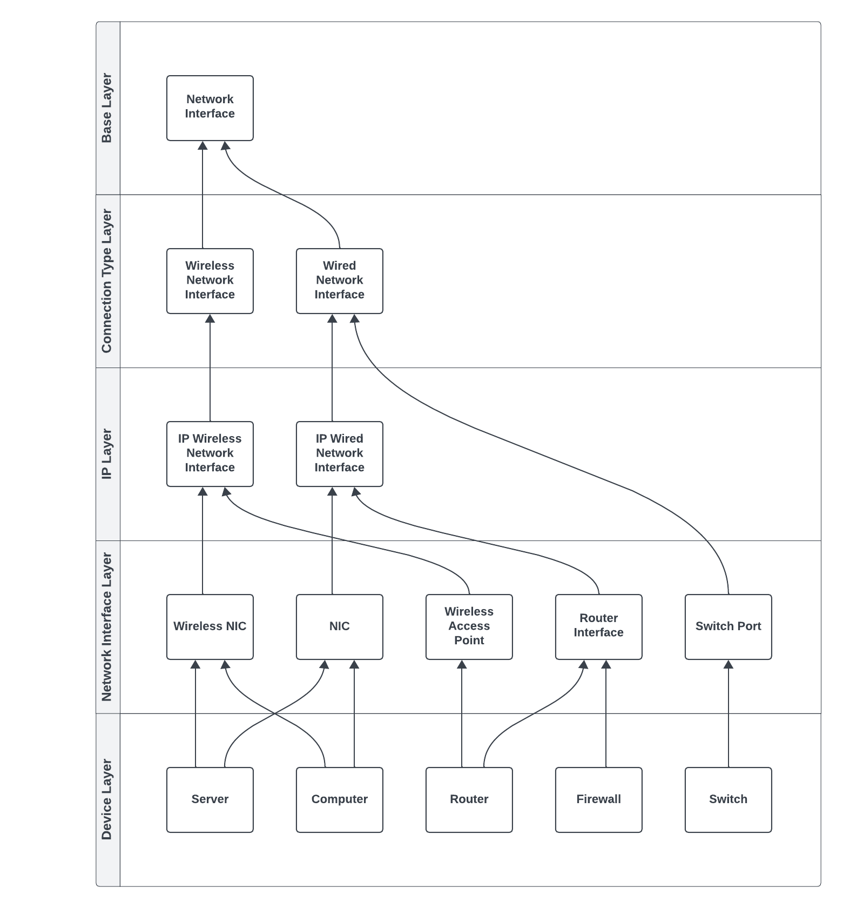

.. only:: comment

    © Crown-owned copyright 2023, Defence Science and Technology Laboratory UK

#################################
Network Interface Hierarchy Model
#################################

The network interface hierarchy model is designed to represent the various types of network interfaces and their
functionalities within a networking system. This model is organised into five distinct layers, each serving a specific
purpose in the abstraction, implementation, and utilisation of network interfaces. This hierarchical structure
facilitates modular development, enhances maintainability, and supports scalability by clearly separating concerns and
allowing for focused enhancements within each layer.

Layer Descriptions
==================

#. **Base Layer**

   * **Purpose:** Serves as the foundation of the hierarchy, defining the most abstract properties and behaviours common
     to all network interfaces.
   * **Content:** Contains the NetworkInterface class, which abstracts basic functionalities such as enabling/disabling
     the interface, sending, and receiving frames.
   * **Significance:** Ensures that core functionalities are universally available across all types of network
     interfaces, promoting code reuse and consistency.

#. **Connection Type Layer**

   * **Purpose:** Differentiates network interfaces based on their physical connection type: wired or wireless.
   * **Content:** Includes ``WiredNetworkInterface`` and ``WirelessNetworkInterface`` classes, each tailoring the base
     functionalities to specific mediums.
   * **Significance:** Allows the development of medium-specific features (e.g., handling point-to-point links in
     wired devices) while maintaining a clear separation from IP-related functionalities.

#. **IP Layer**

   * **Purpose:** Introduces Internet Protocol (IP) capabilities to network interfaces, enabling IP-based networking.
   * **Content:** Includes ``IPWiredNetworkInterface`` and ``IPWirelessNetworkInterface`` classes, extending connection
     type-specific classes with IP functionalities.
   * **Significance:** Facilitates the implementation of IP address assignment, subnetting, and other Layer 3
     networking features, crucial for modern networking applications.

#. **Interface Layer**

   * **Purpose:** Defines concrete implementations of network interfaces for specific devices or roles within a network.
   * **Content:** Includes ``NIC``, ``RouterInterface``, ``SwitchPort``, ``WirelessNIC``, and ``WirelessAccessPoint``
     classes, each  designed for a particular networking function or device.
   * **Significance:** This layer allows developers to directly utilise or extend pre-built interfaces tailored to
     specific networking tasks, enhancing development efficiency and clarity.

#. **Device Layer**

   * **Purpose:** Maps the concrete interface implementations to their respective devices within a network,
     illustrating practical usage scenarios.
   * **Content:** Conceptually groups devices such as ``Computer``, ``Server``, ``Switch``, ``Router``, and ``Firewall``
     with the interfaces they utilise (e.g., ``Computer`` might use ``NIC`` or ``WirelessNIC``).
   * **Significance:** Provides a clear understanding of how various network interfaces are applied in real-world
     devices, aiding in system design and architecture planning.

Network Interface Classes
=========================

**NetworkInterface (Base Layer)**

- Abstract base class defining core interface properties like MAC address, speed, MTU.
- Requires subclasses implement key methods like send/receive frames, enable/disable interface.
- Establishes universal network interface capabilities.
- Malicious Network Events Monitoring:

   * Enhances network interfaces with the capability to monitor and capture Malicious Network Events (MNEs) based on predefined criteria such as specific keywords or traffic patterns.
   * Integrates NMNE detection functionalities, leveraging configurable settings like ``capture_nmne``, `nmne_capture_keywords``, and observation mechanisms such as ``NicObservation`` to classify and record network anomalies.
   * Offers an additional layer of security and data analysis, crucial for identifying and mitigating malicious activities within the network infrastructure. Provides vital information for network security analysis and reinforcement learning algorithms.

**WiredNetworkInterface (Connection Type Layer)**

- Extends NetworkInterface for wired connection interfaces.
- Adds notions of physical/logical connectivity and link management.
- Mandates subclasses implement wired-specific methods.

**WirelessNetworkInterface (Connection Type Layer)**

- Extends NetworkInterface for wireless interfaces.
- Encapsulates wireless-specific behaviours like signal strength handling.
- Requires wireless-specific methods in subclasses.

**Layer3Interface (IP Layer)**

- Introduces IP addressing abilities with ip_address and subnet_mask.
- Validates address configuration.
- Enables participation in IP networking.

**IPWiredNetworkInterface (IP Layer)**

- Merges Layer3Interface and WiredNetworkInterface.
- Defines wired interfaces with IP capabilities.
- Meant to be extended, doesn't implement methods.

**IPWirelessNetworkInterface (IP Layer)**

- Combines Layer3Interface and WirelessNetworkInterface.
- Represents wireless interfaces with IP capabilities.
- Intended to be extended and specialised.

**NIC (Interface Layer)**

- Concrete wired NIC implementation combining IPWiredNetworkInterface and Layer3Interface.
- Provides network connectivity for host nodes.
- Manages MAC and IP addressing, frame processing.

**WirelessNIC (Interface Layer)**

- Concrete wireless NIC implementation combining IPWirelessNetworkInterface and Layer3Interface.
- Delivers wireless connectivity with IP for hosts.
- Handles wireless transmission/reception.

**WirelessAccessPoint (Interface Layer)**

- Concrete wireless access point implementation using IPWirelessNetworkInterface and Layer3Interface.
- Bridges wireless and wired networks.
- Manages wireless network.
