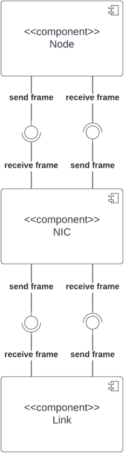

.. only:: comment

    © Crown-owned copyright 2023, Defence Science and Technology Laboratory UK

Physical Layer
==============

The physical layer components are mode of a ``NIC`` (Network Interface Card) and a ``Link``. These components allow
modelling of layer 1 (physical layer) in the OSI model.

NIC
###
The ``NIC`` class is a realistic model of a Network Interface Card. The ``NIC`` acts as the interface between the
``Node`` and the ``Link``.

NICs have the following attributes:

- **ip_address:** The IPv4 address assigned to the NIC.
- **subnet_mask:** The subnet mask assigned to the NIC.
- **gateway:** The default gateway IP address for forwarding network traffic to other networks.
- **mac_address:** The MAC address of the NIC. Defaults to a randomly set MAC address.
- **speed:** The speed of the NIC in Mbps (default is 100 Mbps).
- **mtu:** The Maximum Transmission Unit (MTU) of the NIC in Bytes, representing the largest data packet size it can handle without fragmentation (default is 1500 B).
- **wake_on_lan:** Indicates if the NIC supports Wake-on-LAN functionality.
- **dns_servers:** List of IP addresses of DNS servers used for name resolution.
- **connected_link:** The link to which the NIC is connected.
- **enabled:** Indicates whether the NIC is enabled.

**Basic Example**

.. code-block:: python

    nic1 = NIC(
        ip_address="192.168.1.100",
        subnet_mask="255.255.255.0",
        gateway="192.168.1.1"
    )

Link
####

The ``Link`` class represents a physical link between two network endpoints.

Links have the following attributes:

- **endpoint_a:** The first NIC connected to the Link.
- **endpoint_b:** The second NIC connected to the Link.
- **bandwidth:** The bandwidth of the Link in Mbps (default is 100 Mbps).
- **current_load:** The current load on the link in Mbps.

**Basic Example**

.. code-block:: python

    nic1 = NIC(
        ip_address="192.168.1.100",
        subnet_mask="255.255.255.0",
        gateway="192.168.1.1"
    )
    nic1 = NIC(
        ip_address="192.168.1.101",
        subnet_mask="255.255.255.0",
        gateway="192.168.1.1"
    )

    link = Link(
        endpoint_a=nic1,
        endpoint_b=nic2,
        bandwidth=1000
    )

Link, NIC, Node Interface
#########################

