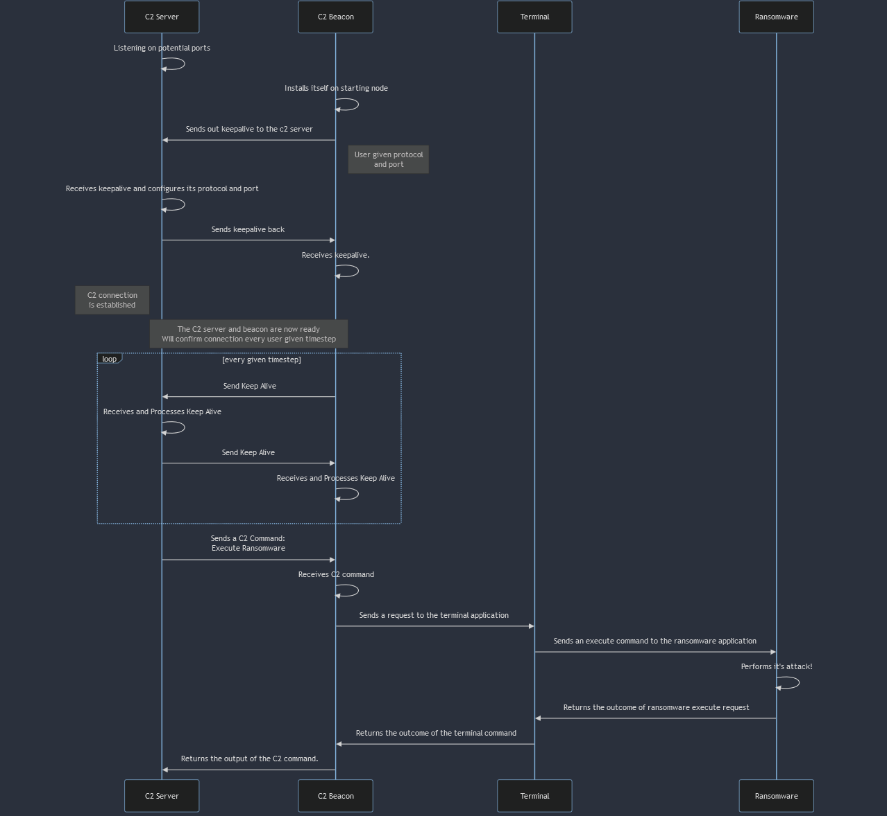

.. only:: comment

    © Crown-owned copyright 2024, Defence Science and Technology Laboratory UK

.. _C2_Suite:

Command and Control Application Suite
#####################################

Comprising of two applications, the Command and Control (C2) suite intends to introduce
malicious network architecture and further the realism of red agents within PrimAITE.

Overview:
=========

These two new classes give red agents a cyber realistic way of leveraging the capabilities of the ``Terminal`` application whilst introducing more opportunities for the blue agent(s) to notice and subvert a red agent during an episode.

For a more in-depth look at the command and control applications then please refer to the ``C2-E2E-Notebook``.

``C2 Server``
"""""""""""""

The C2 Server application is intended to represent the malicious infrastructure already under the control of an adversary.

The C2 Server is configured to listen and await ``keep alive`` traffic from a C2 beacon. Once received the C2 Server is able to send and receive C2 commands.

Currently, the C2 Server offers four commands:

+---------------------+---------------------------------------------------------------------------+
|C2 Command           | Meaning                                                                   |
+=====================+===========================================================================+
|RANSOMWARE_CONFIGURE | Configures an installed ransomware script based on the passed parameters. |
+---------------------+---------------------------------------------------------------------------+
|RANSOMWARE_LAUNCH    | Launches the installed ransomware script.                                 |
+---------------------+---------------------------------------------------------------------------+
|DATA_EXFILTRATION    | Copies a target file from a remote node to the C2 Beacon & Server via FTP |
+---------------------+---------------------------------------------------------------------------+
|TERMINAL             | Executes a command via the terminal installed on the C2 Beacons Host.     |
+---------------------+---------------------------------------------------------------------------+

It's important to note that in order to keep PrimAITE realistic from a cyber perspective,
the C2 Server application should never be visible or actionable upon directly by the blue agent.

This is because in the real world, C2 servers are hosted on ephemeral public domains that would not be accessible by private network blue agent.
Therefore granting blue agent(s) the ability to perform counter measures directly against the application would be unrealistic.

It is more accurate to see the host that the C2 Beacon is installed on as being able to route to the C2 Server (Internet Access).

``C2 Beacon``
"""""""""""""

The C2 Beacon application is intended to represent malware that is used to establish and maintain contact to a C2 Server within a compromised network.

A C2 Beacon will need to be first configured with the C2 Server IP Address which can be done via the ``configure`` method.

Once installed and configured; the C2 beacon can establish connection with the C2 Server via executing the application.

This will send an initial ``keep alive`` to the given C2 Server (The C2 Server IPv4Address must be given upon C2 Beacon configuration).
Which is then resolved and responded by another ``Keep Alive`` by the C2 server back to the C2 beacon to confirm connection.

The C2 Beacon will send out periodic keep alive based on it's configuration parameters to configure it's active connection with the C2 server.

It's recommended that a C2 Beacon is installed and configured mid episode by a Red Agent for a more cyber realistic simulation.

Usage
=====

As mentioned, the C2 Suite is intended to grant Red Agents further flexibility whilst also expanding a blue agent's observation space.

Adding to this, the following behaviour of the C2 beacon can be configured by users for increased domain randomisation:

+---------------------+---------------------------------------------------------------------------+
|Configuration Option | Option Meaning                                                            |
+=====================+===========================================================================+
|c2_server_ip_address | The IP Address of the C2 Server. (The C2 Server must be running)          |
+---------------------+---------------------------------------------------------------------------+
|keep_alive_frequency | How often should the C2 Beacon confirm it's connection in timesteps.      |
+---------------------+---------------------------------------------------------------------------+
|masquerade_protocol  | What protocol should the C2 traffic masquerade as? (HTTP, FTP or DNS)     |
+---------------------+---------------------------------------------------------------------------+
|masquerade_port      | What port should the C2 traffic use? (TCP or UDP)                         |
+---------------------+---------------------------------------------------------------------------+

Implementation
==============

Both applications inherit from an abstract C2 which handles the keep alive functionality and main logic.
However, each host implements it's own receive methods.

- The ``C2 Beacon`` is responsible for the following logic:
    - Establishes and confirms connection to the C2 Server via sending ``C2Payload.KEEP_ALIVE``.
    - Receives and executes C2 Commands given by the C2 Server via ``C2Payload.INPUT``.
    - Returns the RequestResponse of the C2 Commands executed back the C2 Server via ``C2Payload.OUTPUT``.

- The ``C2 Server`` is responsible for the following logic:
    - Listens and resolves connection to a C2 Beacon via responding to ``C2Payload.KEEP_ALIVE``.
    - Sends C2 Commands to the C2 Beacon via ``C2Payload.INPUT``.
    - Receives the RequestResponse of the C2 Commands executed by C2 Beacon via ``C2Payload.OUTPUT``.

The sequence diagram below clarifies the functionality of both applications:

For further details and more in-depth examples please refer to the ``Command-&-Control notebook``

Examples
========

Python
""""""
.. code-block:: python

    from primaite.simulator.network.container import Network
    from primaite.simulator.network.hardware.nodes.host.computer import Computer
    from primaite.simulator.network.hardware.nodes.network.switch import Switch
    from primaite.simulator.system.applications.database_client import DatabaseClient
    from primaite.simulator.system.applications.red_applications.ransomware_script import RansomwareScript
    from primaite.simulator.system.services.database.database_service import DatabaseService
    from primaite.simulator.system.applications.red_applications.c2.c2_server import C2Command, C2Server
    from primaite.simulator.system.applications.red_applications.c2.c2_beacon import C2Beacon

    # Network Setup
    network = Network()

    switch = Switch(hostname="switch", start_up_duration=0, num_ports=4)
    switch.power_on()

    node_a = Computer(hostname="node_a", ip_address="192.168.0.10", subnet_mask="255.255.255.0", start_up_duration=0)
    node_a.power_on()
    network.connect(node_a.network_interface[1], switch.network_interface[1])

    node_b = Computer(hostname="node_b", ip_address="192.168.0.11", subnet_mask="255.255.255.0", start_up_duration=0)
    node_b.power_on()

    network.connect(node_b.network_interface[1], switch.network_interface[2])

    node_c = Computer(hostname="node_c", ip_address="192.168.0.12", subnet_mask="255.255.255.0", start_up_duration=0)
    node_c.power_on()
    network.connect(node_c.network_interface[1], switch.network_interface[3])

    node_c.software_manager.install(software_class=DatabaseService)
    node_b.software_manager.install(software_class=DatabaseClient)
    node_b.software_manager.install(software_class=RansomwareScript)
    node_a.software_manager.install(software_class=C2Server)

    # C2 Application objects

    c2_server_host: Computer = network.get_node_by_hostname("node_a")
    c2_beacon_host: Computer = network.get_node_by_hostname("node_b")

    c2_server: C2Server = c2_server_host.software_manager.software["C2Server"]
    c2_beacon: C2Beacon = c2_beacon_host.software_manager.software["C2Beacon"]

    # Configuring the C2 Beacon
    c2_beacon.configure(c2_server_ip_address="192.168.0.10", keep_alive_frequency=5)

    # Launching the C2 Server (Needs to be running in order to listen for connections)
    c2_server.run()

    # Establishing connection
    c2_beacon.establish()

    # Example command: Creating a file

    file_create_command = {
        "commands": [
            ["file_system", "create", "folder", "test_folder"],
            ["file_system", "create", "file", "test_folder", "example_file", "True"],
        ],
        "username": "admin",
        "password": "admin",
        "ip_address": None,
    }

    c2_server.send_command(C2Command.TERMINAL, command_options=file_create_command)

    # Example command: Installing and configuring Ransomware:

    ransomware_installation_command = { "commands": [
            ["software_manager","application","install","RansomwareScript"],
        ],
        "username": "admin",
        "password": "admin",
        "ip_address": None,
    }
    c2_server.send_command(given_command=C2Command.TERMINAL, command_options=ransomware_installation_command)

    ransomware_config = {"server_ip_address": "192.168.0.12"}

    c2_server.send_command(given_command=C2Command.RANSOMWARE_CONFIGURE, command_options=ransomware_config)

    c2_beacon_host.software_manager.show()

    # Example command: File Exfiltration

    data_exfil_options = {
        "username": "admin",
        "password": "admin",
        "ip_address": None,
        "target_ip_address": "192.168.0.12",
        "target_file_name": "database.db",
        "target_folder_name": "database",
    }

    c2_server.send_command(given_command=C2Command.DATA_EXFILTRATION, command_options=data_exfil_options)

    # Example command: Launching Ransomware

    c2_server.send_command(given_command=C2Command.RANSOMWARE_LAUNCH, command_options={})

Via Configuration
"""""""""""""""""

.. code-block:: yaml

    simulation:
        network:
            nodes:
                - ref: example_computer_1
                hostname: computer_a
                type: computer
                ...
                applications:
                    type: C2Server
            ...
                hostname: computer_b
                type: computer
                ...
                # A C2 Beacon will not automatically connection to a C2 Server.
                # Either an agent must use application_execute.
                # Or a if using the simulation layer - .establish().
                applications:
                    type: C2Beacon
                    options:
                        c2_server_ip_address: ...
                        keep_alive_frequency: 5
                        masquerade_protocol: tcp
                        masquerade_port: http
                        listen_on_ports:
                            - 80
                            - 53
                            - 21

C2 Beacon Configuration
=======================

``Common Attributes``
"""""""""""""""""""""

See :ref:`Common Configuration`

``c2_server_ip_address``
""""""""""""""""""""""""

IP address of the ``C2Server`` that the C2 Beacon will use to establish connection.

This must be a valid octet i.e. in the range of ``0.0.0.0`` and ``255.255.255.255``.

``Keep Alive Frequency``
""""""""""""""""""""""""

How often should the C2 Beacon confirm it's connection in timesteps.

For example, if the keep alive Frequency is set to one then every single timestep
the C2 connection will be confirmed.

It's worth noting that this may be useful option when investigating
network blue agent observation space.

This must be a valid integer i.e ``10``. Defaults to ``5``.

``Masquerade Protocol``
"""""""""""""""""""""""

The protocol that the C2 Beacon will use to communicate to the C2 Server with.

Currently only ``TCP`` and ``UDP`` are valid masquerade protocol options.

It's worth noting that this may be useful option to bypass ACL rules.

This must be a string i.e *UDP*. Defaults to ``TCP``.

*Please refer to the ``IPProtocol`` class for further reference.*

``Masquerade Port``
"""""""""""""""""""

What port that the C2 Beacon will use to communicate to the C2 Server with.

Currently only ``FTP``, ``HTTP`` and ``DNS`` are valid masquerade port options.

It's worth noting that this may be a useful option to bypass ACL rules.

This must be a string i.e ``DNS``. Defaults to ``HTTP``.

*Please refer to the ``IPProtocol`` class for further reference.*

C2 Server Configuration
=======================

*The C2 Server does not currently offer any unique configuration options and will configure itself to match the C2 beacon's network behaviour.*

``Common Attributes``
"""""""""""""""""""""

See :ref:`Common Configuration`
