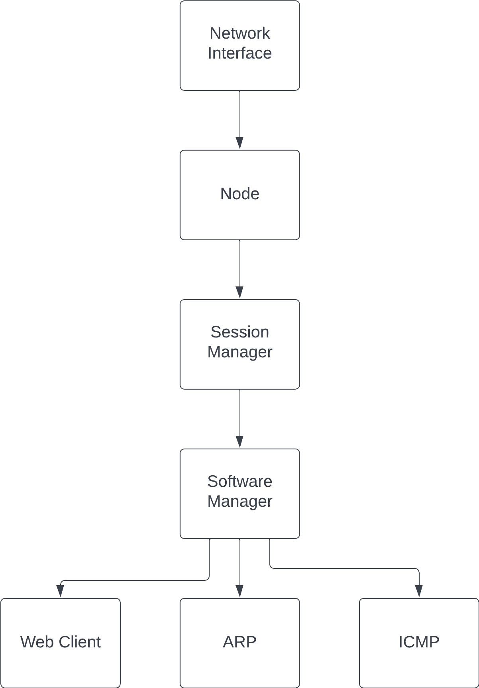

.. only:: comment

    © Crown-owned copyright 2024, Defence Science and Technology Laboratory UK

Session and Software Manager
============================

The Software Manager and Session Manager are core components of the Node in PrimAITE. These managers orchestrate the
flow of network frames through the Node, ensuring that frames are processed accurately and passed to the relevant
services or applications.

The following flow diagram illustrates the journey of a network frame as it navigates through various components within
the node. Starting from the network interface, the frame progresses to the node, then to the session manager, and
subsequently to the software manager. From there, it may be directed to one of three potential software destinations:
ARP, ICMP, or the Web Client. This pathway exemplifies the structured processing sequence designed to ensure that
each frame reaches its intended target within the simulated environment.

Session Manager
---------------

The `SessionManager` acts as the intermediary between the Node's hardware-level interactions and higher-level software
processes. It receives frames from the Node and determines the appropriate session or connection context for further
processing.

**Key Responsibilities:**

- **Frame Handling:** Receives network frames and identifies the session context based on headers and session state.
- **Protocol Management:** Supports various protocols (e.g., ARP, ICMP) by interpreting protocol-specific information
  within frames and facilitating their processing.
- **Session Tracking:** Maintains a record of active sessions and manages their lifecycle, including creation,
  maintenance, and termination.

**Implementation Overview:**

- Utilises IP and transport layer information to route frames to the correct session.
- Integrates closely with the `SoftwareManager` to ensure seamless transmission of session-specific data to the
  application layer.

Software Manager
----------------

The `SoftwareManager` is responsible for the final step in the frame processing pipeline, handling the delivery of
network frames to the appropriate software services or applications within the Node.

**Key Responsibilities:**

- **Application Routing:** Determines the target application or service for incoming frames based on protocol and port
  information.
- **Software Management:** Oversees the registration, installation, and management of software services and
  applications, facilitating communication between network layers and application processes.
- **Frame Dispatching:** Directs frames to their designated applications or services, enabling the processing of
  network communications at the application layer.
- **Installation and Uninstallation:** Responsible for the installing and uninstalling of services and applications,
  managing the availability of software resources on the Node.

**Implementation Overview:**

- Maintains a registry of services and applications, keyed by protocol and port numbers, to efficiently route network
  traffic.
- Interacts with the `FileSystem` and other core components to manage application state and data persistence,
  supporting complex software interactions within the simulated environment.

Integration and Workflow
------------------------

1. **Initial Port Check:** Upon receiving a network frame at the hardware level, the Node first checks if the
   destination port and protocol match any software currently running, as managed by the `SoftwareManager`. This step
   determines if the port is open and if the frame's destination is actively listening for incoming traffic on the Node.
2. **Frame Acceptance:** If the frame's destination port and protocol are open on the Node, indicating that there is
   software prepared to handle such traffic, the Node accepts the frame. This verification ensures that only relevant
   traffic is processed further, enhancing network security and efficiency.
3. **Session Manager Processing:** Accepted frames are then passed to the `SessionManager`, which analyses the frames
   within the context of existing sessions or connections. The Session Manager performs protocol-specific handling,
   routing the frames based on session state and protocol requirements.
4. **Software Manager Dispatch:** After session processing, frames are dispatched to the `SoftwareManager`, which
   routes them to the appropriate services or applications. The Software Manager identifies the target based on the
   frame's destination port and protocol, aligning with the initial port check.
5. **Application Processing:** The relevant applications or services process the received frames, completing the
   communication pathway within the Node. This step involves the actual handling of frame data by the intended software,
   facilitating the intended network operations or communications.

Together, the Software Manager and Session Manager form a critical part of the Node's architecture in the PrimAITE,
facilitating a structured and efficient processing pipeline for network frames. This architecture enables the
simulation of realistic network environments, where frames are accurately routed and processed, mirroring the
complexities of real-world network communications. The addition of installation and uninstallation capabilities by
the Software Manager further enhances the Node's functionality, allowing for dynamic software management within the
simulated network.
