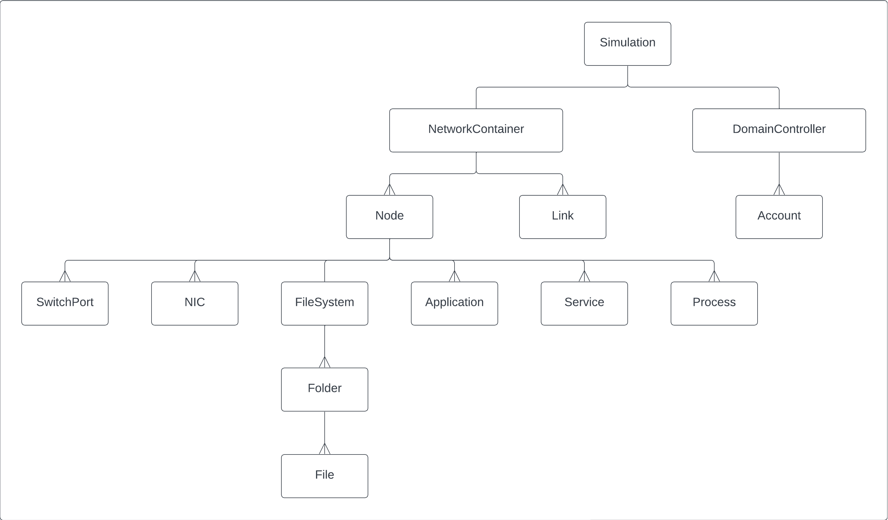

.. only:: comment

    © Crown-owned copyright 2025, Defence Science and Technology Laboratory UK

Simulation Structure
====================

The simulation is made up of many smaller components which are related to each other in a tree-like structure. At the
top level, there is the :py:meth:`primaite.simulator.sim_container.Simulation`, which keeps track of the physical network and a domain controller for managing software and users.

Each node of the simulation 'tree' has responsibility for creating, deleting, and updating its direct descendants. Also,
when a component's ``describe_state()`` method is called, it will include the state of its descendants. The
``apply_request()`` method can be used to act on a component or one of its descendants. The diagram below shows the
relationship between components.

                list of accounts. The network container has links and nodes. Nodes can own switchports, NICs, FileSystem,
                Application, Service, and Process.

Actions
=======
Agents can interact with the simulation by using actions. Actions adhere to the Common Action and Observation Space (CAOS) specification, and are converted into Requests for use by the simulation. Requests are standardised via the :py:class:`primaite.simulation.core.RequestType` class, which just holds a reference to two special functions.

1. The function that actions the request, it must accept a `request` parameters which is a list of strings that describe what the action should do. It must also accept a `context` dict which can house additional information surrounding the action.
2. A validator function. This function should return a boolean value that decides if the request is permitted or not. It uses the same paramters as the action function.

Action Validation
------------------
When an agent tries to perform an action on a simulation component, that action will only be executed if the request is validated. For example, some actions can require that the target network node is powered on. Each action defines its
own permissions using an instance of :py:class:`primaite.simulation.core.ActionPermissionValidator`. The below code
snippet demonstrates usage of the ``ActionPermissionValidator``.

.. code:: python

    from primaite.simulator.core import Action, RequestManager, SimComponent, ActionPermissionValidator
    from primaite.interface.request import RequestResponse

    class Smartphone(SimComponent):
        name: str
        connected: bool
        apps: List = []

        class _ConnectedToNetworkValidator(ActionPermissionValidator):

            smartphone: Smarphone
            """A reference to the smartphone object."""

            def __call__(self, request: RequestFormat, context: Dict) -> bool:
                return self.smartphone.connected

        def _init_request_manager(self) -> RequestManager:
            am = super()._init_request_manager()
            am.add_request(
                "reset_factory_settings",
                ReqeustType(
                    func = lambda request, context: RequestResponse.from_bool(self.reset_factory_settings()),
                    validator = Smartphone._ConnectedToNetworkValidator(smartphone=self),
                )
            )

        def reset_factory_settings(self):
            self.apps = []
            return True

    phone = Smartphone(name="phone1", connected=False)
    phone.apply_request(request=["reset_factory_settings"])
    # >>> False

    phone2 = Smartphone(name="phone2", connected=True)
    phone.apply_request(request=["reset_factory_settings"])
    # >>> True
